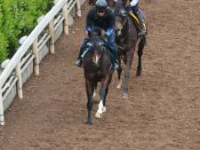
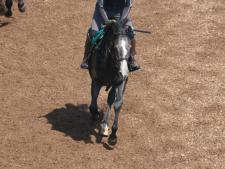
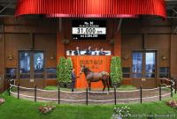
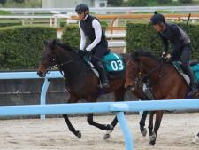
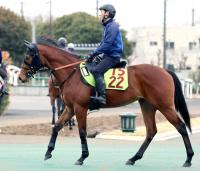
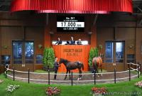
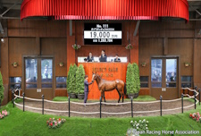
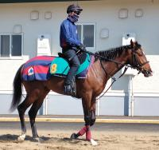

# POG 2026-2027 おすすめ馬 上位50頭 調査ノート

作成日: 2026-05-30

このMarkdownは、ユーザー提示の50頭を表示順どおりに並べ、POG-INFO、netkeiba、POG-UP、日刊競馬POG、ウマニティPOGなどの公開情報を参照しながら作った調査メモです。事実として確認できた情報と、血統から読む楽しみどころを分けて残します。

## 画像利用メモ

- 画像保存先: `2026/images/`
- 対象馬本人と判断できるnetkeibaニュース画像を一部ローカル保存済みです。公開ページへ再掲載してよいかは未確認です。
- 画像欄に保存ファイルがあるものも、公開利用は要確認です。未保存の馬は「画像未取得」のまま残しています。
- 後で画像を追加する場合は、`2026/images/01-jangod.jpg` のように順位つきの安全なファイル名にし、画像出典、元ページURL、取得日、公開利用可否を各馬の欄に追記します。

## 参考ソース一覧

- [POG-INFO 2026年度 指名馬ランキング](https://poginfo.com/pogs/pogRanking/2026)
- [netkeiba POG2026-2027 有力馬まとめ](https://dir.netkeiba.com/keibamatome/detail.html?no=5657)
- [POG-UP 関係者コメント全集](https://keiba-pog.com/pog-2026-2027-insider-comments/)
- [POG-UP 牡馬おすすめ](https://keiba-pog.com/pog-2026-colt-picks/)
- [POG-UP 注目馬分析](https://keiba-pog.com/pog-2026-2027-featured-horses/)
- [POG-UP 厩舎ランキング](https://keiba-pog.com/pog-2026-stable-ranking/)
- [日刊競馬POG 2026-2027 指名馬ランキング](https://www.nikkankeiba.com/pog2026/index.php?func=ranking_horse)
- [ウマニティPOG 2026-2027](https://pog.umanity.jp/2026/)
- [POGブログドットコム 2026-2027カテゴリ](https://pog-blog.com/category/pog-2026-2027/)

## 表示順一覧

| 順位 | 馬名 | 母 | 父 | データ状況 |
| ---: | --- | --- | --- | --- |
| 1 | ジャンゴッド | マーゴットディド | キタサンブラック | POG-INFO個別あり |
| 2 | エルドボルグ | コンサートホール | キタサンブラック | POG-INFO個別あり |
| 3 | ソブリオ | ノームコア | キタサンブラック | POG-INFO個別あり |
| 4 | チェスティーノ | チェッキーノ | エフフォーリア | POG-INFO個別あり |
| 5 | ダノンダックス | ヤンキーローズ | サートゥルナーリア | POG-INFO個別あり |
| 6 | ラガリーガ | ラサルダン | キズナ | POG-INFO個別あり |
| 7 | ジョドレルバンク | アースライズ | エフフォーリア | POG-INFO個別あり |
| 8 | ダイナマイク | シンプリーラヴィシング | キタサンブラック | POG-INFO個別あり |
| 9 | ラッキースパークル | ラッキーライラック | エピファネイア | POG-INFO個別あり |
| 10 | ノイエルング | プレミアエンブレム | フィエールマン | POG-INFO個別あり / 父母差異あり |
| 11 | レジューノワール | アーモンドアイ | キタサンブラック | POG-INFO個別あり |
| 12 | イルリサット | アエロリット | キズナ | POG-INFO個別あり |
| 13 | リボンロード | ジュベルアリ | リオンディーズ | POG-INFO個別あり |
| 14 | シャムリベルク | スイススカイダイバー | エピファネイア | POG-INFO個別あり |
| 15 | サンタンジェロ | モアナアネラ | エピファネイア | POG-INFO個別あり |
| 16 | エクアトーレ | シャトーブランシュ | キタサンブラック | POG-INFO個別あり |
| 17 | ホウオウモノポリー | インカーヴィル | キズナ | POG-INFO個別あり |
| 18 | ウィクフォード | ウィクトーリア | キタサンブラック | POG-INFO個別あり |
| 19 | フィリオソラーレ | フィリアプーラ | エピファネイア | POG-INFO個別あり |
| 20 | ユタライト | ユナカイト | ロードカナロア | POG-INFO個別あり |
| 21 | フェニックスロール | コスモポリタンクイーン | コントレイル | 外部ページ要追加確認 |
| 22 | マスターズボンド | スクールミストレス | キズナ | 外部ページ要追加確認 |
| 23 | キューティボンド | コーステッド | サートゥルナーリア | POG-INFO個別あり |
| 24 | ダノンデスティニー | コンヴィクション２ | キタサンブラック | POG-INFO個別あり |
| 25 | バティック | カット | エピファネイア | 外部ページ要追加確認 |
| 26 | ゼビウス | ビブロス | エピファネイア | 外部ページ要追加確認 |
| 27 | アドマイヤモカ | アドマイヤミヤビ | モーリス | POG-INFO個別あり |
| 28 | タクティシアン | モルジアナ | サリオス | POG-INFO個別あり |
| 29 | インサイドエッジ | デアリングエッジ | エピファネイア | POG-INFO個別あり |
| 30 | メアグローリア | アンティフォナ | サリオス | POG-INFO個別あり |
| 31 | ミエルモーサ | ミスエルテ | シルバーステート | POG-INFO個別あり |
| 32 | シアルナーレ | ストロベリームーン | コントレイル | POG-INFO個別あり |
| 33 | ベトロテンペスタ | シャンパンエニワン | コントレイル | 外部ページ要追加確認 |
| 34 | エスクアドラ | ジューヌエコール | レイデオロ | POG-INFO個別あり |
| 35 | ブレイクアウェイ | ザウェイアイアム | キズナ | 外部ページ要追加確認 |
| 36 | クインアマランサスの24 | クインアマランサス | ゴールドドリーム | 外部ページ要追加確認 |
| 37 | キラービューティの24 | キラービューティ | ドレフォン | 外部ページ要追加確認 |
| 38 | エリカプロヴァンス | チェロキーメイドン | キタサンブラック | POG-INFO個別あり |
| 39 | ミッドナイトビズーの24 | ミッドナイトビズー | キタサンブラック | 外部ページ要追加確認 |
| 40 | ソシアルクラブの24 | ソシアルクラブ | キタサンブラック | 外部ページ要追加確認 |
| 41 | ログポーズ | プティフォリー | キタサンブラック | 外部ページ要追加確認 |
| 42 | ヴィルマリー | レキシールー | キタサンブラック | 外部ページ要追加確認 |
| 43 | ベラジオパンテーラ | ダイワダッチェス | キズナ | POG-INFO個別あり |
| 44 | リリックラヴ | エピックラヴ | ロードカナロア | POG-INFO個別あり |
| 45 | キトゥンズクラフト | ダンスウィズキトゥン | オルフェーヴル | 外部ページ要追加確認 |
| 46 | コナパームス | コナブリュワーズ | アドマイヤマーズ | POG-INFO個別あり |
| 47 | レッドインサイト | ダンシングラグズ | エピファネイア | POG-INFO個別あり |
| 48 | ルーメンルーナエ | ルリアナ | エピファネイア | POG-INFO個別あり |
| 49 | ベルバーニア | アドマイヤローザ | キタサンブラック | 外部ページ要追加確認 |
| 50 | エターナルバラード | バラーディスト | ロードカナロア | POG-INFO個別あり |

## 追加するともっと雑誌っぽくなる情報

- 馬体写真と撮影時期、撮影場所、クレジット
- 測尺、馬体重、募集価格、セリ価格
- 入厩日、ゲート試験合格日、初時計、デビュー予定
- 兄姉の勝ち上がり時期と得意条件
- 専門家コメントの引用ではなく要約と媒体名
- 指名人気の推移、穴人気になりそうな理由
- 馬名由来、クラブコメント、牧場コメント

## 個別メモ

### 01. ジャンゴッド

- 表示: ジャンゴッド | マーゴットディド | キタサンブラック
- 画像: 画像未取得
  - 保存ファイル: 未作成
  - 画像出典: 未確認
  - 公開利用: 要確認

**基本情報**

- 性別: 牡
- 生年月日: 2024/02/21 (2歳)
- 毛色: 鹿毛
- 厩舎: 杉山晴紀 (栗)
- 生産者: ノーザンファーム
- 馬主: 藤田 晋
- 馬名由来: 麻雀の神
- POG-INFO指名人気: 2位 / 指名数 31 / 本賞金 0.0

**父の特色**

中長距離の持続力と大舞台感を連想しやすい種牡馬。イクイノックス以降、POGでは「クラシックまで待てる大物枠」として見られやすい。

**母の特色**

英G1ナンソープS勝ち馬として知られるスピード豊かな母。キタサンブラックとの配合では、母の速さと父の持続力の混ざり方が見どころ。

**POG的な楽しみどころ**

POG-INFO指名人気 2位（指名数 31） / 提示リスト上位の中心候補 / POG-INFO個別ページ確認済み。父キタサンブラック×母マーゴットディドという入力リストの血統設定を軸に、デビュー時期、厩舎コメント、ゲート試験、調教時計が出てきたら評価を更新したい。

**参考ページ**

- [netkeiba DB](https://db.netkeiba.com/horse/2024106624/), [POG-INFO 個別ページ](https://poginfo.com/pogs/horseData/show/2024106624), [POG-INFO 指名馬ランキング](https://poginfo.com/pogs/pogRanking/2026), [追加調査用検索](https://www.google.com/search?q=%E3%82%B8%E3%83%A3%E3%83%B3%E3%82%B4%E3%83%83%E3%83%89%20%E3%83%9E%E3%83%BC%E3%82%B4%E3%83%83%E3%83%88%E3%83%87%E3%82%A3%E3%83%89%20%E3%82%AD%E3%82%BF%E3%82%B5%E3%83%B3%E3%83%96%E3%83%A9%E3%83%83%E3%82%AF%20POG%202026%202027)

**未確認メモ**

- 対象馬本人の画像、画像の公開利用可否、入厩/ゲート試験/デビュー予定

### 02. エルドボルグ

- 表示: エルドボルグ | コンサートホール | キタサンブラック
- 画像: 保存済み
  - 保存ファイル: images/02-eldborg.jpg
  - 画像出典: netkeibaニュース「コンサートホールの2024(エルドボルグ)など、先週の入厩情報/栗東トレセンニュース」
  - 元ページURL: https://news.netkeiba.com/?pid=news_view&no=328761
  - 取得日: 2026-05-30
  - 公開利用: 要確認（調査用にローカル保存）
  - プレビュー: 

**基本情報**

- 性別: 牡
- 生年月日: 2024/03/22 (2歳)
- 毛色: 鹿毛
- 厩舎: 斉藤崇史 (栗)
- 生産者: ノーザンファーム
- 馬主: サンデーレーシング
- 馬名由来: アイスランドのコンサートホール、ハルパのメインホール名
- POG-INFO指名人気: 3位 / 指名数 30 / 本賞金 0.0

**父の特色**

中長距離の持続力と大舞台感を連想しやすい種牡馬。イクイノックス以降、POGでは「クラシックまで待てる大物枠」として見られやすい。

**母の特色**

欧州で重賞級の実績を持つ良血牝馬として扱われる母。父キタサンブラックで日本の芝中距離に寄せた時の変化を見たい。

**POG的な楽しみどころ**

POG-INFO指名人気 3位（指名数 30） / 提示リスト上位の中心候補 / POG-INFO個別ページ確認済み。父キタサンブラック×母コンサートホールという入力リストの血統設定を軸に、デビュー時期、厩舎コメント、ゲート試験、調教時計が出てきたら評価を更新したい。

**参考ページ**

- [netkeiba DB](https://db.netkeiba.com/horse/2024106314/), [POG-INFO 個別ページ](https://poginfo.com/pogs/horseData/show/2024106314), [POG-INFO 指名馬ランキング](https://poginfo.com/pogs/pogRanking/2026), [追加調査用検索](https://www.google.com/search?q=%E3%82%A8%E3%83%AB%E3%83%89%E3%83%9C%E3%83%AB%E3%82%B0%20%E3%82%B3%E3%83%B3%E3%82%B5%E3%83%BC%E3%83%88%E3%83%9B%E3%83%BC%E3%83%AB%20%E3%82%AD%E3%82%BF%E3%82%B5%E3%83%B3%E3%83%96%E3%83%A9%E3%83%83%E3%82%AF%20POG%202026%202027)

**未確認メモ**

- 対象馬本人の画像、画像の公開利用可否、入厩/ゲート試験/デビュー予定

### 03. ソブリオ

- 表示: ソブリオ | ノームコア | キタサンブラック
- 画像: 保存済み
  - 保存ファイル: images/03-sobrio.jpg
  - 画像出典: netkeibaニュース「ノームコアの2024(ソブリオ)など、先週の入厩情報/栗東トレセンニュース」
  - 元ページURL: https://news.netkeiba.com/?pid=news_view&no=331537
  - 取得日: 2026-05-30
  - 公開利用: 要確認（調査用にローカル保存）
  - プレビュー: 

**基本情報**

- 性別: 牡
- 生年月日: 2024/03/15 (2歳)
- 毛色: 芦毛
- 厩舎: 友道康夫 (栗)
- 生産者: ノーザンファーム
- 馬主: 金子真人ホールディングス
- 馬名由来: 質素（西）
- POG-INFO指名人気: 8位 / 指名数 24 / 本賞金 0.0

**父の特色**

中長距離の持続力と大舞台感を連想しやすい種牡馬。イクイノックス以降、POGでは「クラシックまで待てる大物枠」として見られやすい。

**母の特色**

ヴィクトリアマイル、香港カップを勝ったG1牝馬。スピードと中距離対応力の両方を持つ母として、クラシック距離への想像が膨らむ。

**POG的な楽しみどころ**

POG-INFO指名人気 8位（指名数 24） / 提示リスト上位の中心候補 / POG-INFO個別ページ確認済み。父キタサンブラック×母ノームコアという入力リストの血統設定を軸に、デビュー時期、厩舎コメント、ゲート試験、調教時計が出てきたら評価を更新したい。

**参考ページ**

- [netkeiba DB](https://db.netkeiba.com/horse/2024106496/), [POG-INFO 個別ページ](https://poginfo.com/pogs/horseData/show/2024106496), [POG-INFO 指名馬ランキング](https://poginfo.com/pogs/pogRanking/2026), [追加調査用検索](https://www.google.com/search?q=%E3%82%BD%E3%83%96%E3%83%AA%E3%82%AA%20%E3%83%8E%E3%83%BC%E3%83%A0%E3%82%B3%E3%82%A2%20%E3%82%AD%E3%82%BF%E3%82%B5%E3%83%B3%E3%83%96%E3%83%A9%E3%83%83%E3%82%AF%20POG%202026%202027)

**未確認メモ**

- 対象馬本人の画像、画像の公開利用可否、入厩/ゲート試験/デビュー予定

### 04. チェスティーノ

- 表示: チェスティーノ | チェッキーノ | エフフォーリア
- 画像: 画像未取得
  - 保存ファイル: 未作成
  - 画像出典: 未確認
  - 公開利用: 要確認

**基本情報**

- 性別: 牡
- 生年月日: 2024/04/11 (2歳)
- 毛色: 黒鹿毛
- 厩舎: 鹿戸雄一 (美)
- 生産者: ノーザンファーム
- 馬主: サンデーレーシング
- 馬名由来: 籠（伊）
- POG-INFO指名人気: 4位 / 指名数 29 / 本賞金 0.0

**父の特色**

皐月賞、天皇賞（秋）、有馬記念を勝った新しめの父。産駒傾向はこれから固まる段階なので、父の競走実績と母系の裏付けを合わせて楽しむ枠。

**母の特色**

フローラS勝ち、オークス2着の実績を持つ母。父エフフォーリアとの組み合わせは、王道路線の雰囲気が強い。

**POG的な楽しみどころ**

POG-INFO指名人気 4位（指名数 29） / 提示リスト上位の中心候補 / POG-INFO個別ページ確認済み。父エフフォーリア×母チェッキーノという入力リストの血統設定を軸に、デビュー時期、厩舎コメント、ゲート試験、調教時計が出てきたら評価を更新したい。

**参考ページ**

- [netkeiba DB](https://db.netkeiba.com/horse/2024106452/), [POG-INFO 個別ページ](https://poginfo.com/pogs/horseData/show/2024106452), [POG-INFO 指名馬ランキング](https://poginfo.com/pogs/pogRanking/2026), [追加調査用検索](https://www.google.com/search?q=%E3%83%81%E3%82%A7%E3%82%B9%E3%83%86%E3%82%A3%E3%83%BC%E3%83%8E%20%E3%83%81%E3%82%A7%E3%83%83%E3%82%AD%E3%83%BC%E3%83%8E%20%E3%82%A8%E3%83%95%E3%83%95%E3%82%A9%E3%83%BC%E3%83%AA%E3%82%A2%20POG%202026%202027)

**未確認メモ**

- 対象馬本人の画像、画像の公開利用可否、入厩/ゲート試験/デビュー予定

### 05. ダノンダックス

- 表示: ダノンダックス | ヤンキーローズ | サートゥルナーリア
- 画像: 保存済み
  - 保存ファイル: images/05-danon-dax.jpg
  - 画像出典: netkeibaニュース「【セレクトセール】3冠牝馬リバティ半弟に3億1000万円　岡田ディレクター「期待しています」」
  - 元ページURL: https://news.netkeiba.com/?pid=news_view&no=302309
  - 取得日: 2026-05-30
  - 公開利用: 要確認（調査用にローカル保存）
  - プレビュー: 

**基本情報**

- 性別: 牡
- 生年月日: 2024/02/19 (2歳)
- 毛色: 黒鹿毛
- 厩舎: 田中博康 (美)
- 生産者: ノーザンファーム
- 馬主: ダノックス
- 馬名由来: 冠名＋フランスの地名
- POG-INFO指名人気: 5位 / 指名数 28 / 本賞金 0.0

**父の特色**

ロードカナロア×シーザリオの血を持つ新世代種牡馬。スピード、瞬発力、シーザリオ牝系の底力をどう伝えるかがPOG的な見どころ。

**母の特色**

豪G1馬で、リバティアイランドの母としても注目度が高い。父サートゥルナーリアとの組み合わせはスター性十分。

**POG的な楽しみどころ**

POG-INFO指名人気 5位（指名数 28） / 提示リスト上位の中心候補 / POG-INFO個別ページ確認済み。父サートゥルナーリア×母ヤンキーローズという入力リストの血統設定を軸に、デビュー時期、厩舎コメント、ゲート試験、調教時計が出てきたら評価を更新したい。

**参考ページ**

- [netkeiba DB](https://db.netkeiba.com/horse/2024106662/), [POG-INFO 個別ページ](https://poginfo.com/pogs/horseData/show/2024106662), [POG-INFO 指名馬ランキング](https://poginfo.com/pogs/pogRanking/2026), [追加調査用検索](https://www.google.com/search?q=%E3%83%80%E3%83%8E%E3%83%B3%E3%83%80%E3%83%83%E3%82%AF%E3%82%B9%20%E3%83%A4%E3%83%B3%E3%82%AD%E3%83%BC%E3%83%AD%E3%83%BC%E3%82%BA%20%E3%82%B5%E3%83%BC%E3%83%88%E3%82%A5%E3%83%AB%E3%83%8A%E3%83%BC%E3%83%AA%E3%82%A2%20POG%202026%202027)

**未確認メモ**

- 対象馬本人の画像、画像の公開利用可否、入厩/ゲート試験/デビュー予定

### 06. ラガリーガ

- 表示: ラガリーガ | ラサルダン | キズナ
- 画像: 画像未取得
  - 保存ファイル: 未作成
  - 画像出典: 未確認
  - 公開利用: 要確認

**基本情報**

- 性別: 牡
- 生年月日: 2024/03/03 (2歳)
- 毛色: 青鹿毛
- 厩舎: 手塚貴久 (美)
- 生産者: ノーザンファーム
- 馬主: キャロットファーム
- 馬名由来: スペイン、カタルーニャ地方にある地名。母名より連想
- POG-INFO指名人気: 6位 / 指名数 25 / 本賞金 0.0

**父の特色**

ディープインパクト後継として、芝中距離の持続力と完成度を期待しやすい父。クラシック路線でも堅実に候補を出すタイプとして見たい。

**母の特色**

入力リストでは母ラサルダン。競走実績、産駒実績、近親の重賞実績は追加確認したい。

**POG的な楽しみどころ**

POG-INFO指名人気 6位（指名数 25） / 提示リスト上位の中心候補 / POG-INFO個別ページ確認済み。父キズナ×母ラサルダンという入力リストの血統設定を軸に、デビュー時期、厩舎コメント、ゲート試験、調教時計が出てきたら評価を更新したい。

**参考ページ**

- [netkeiba DB](https://db.netkeiba.com/horse/2024106670/), [POG-INFO 個別ページ](https://poginfo.com/pogs/horseData/show/2024106670), [POG-INFO 指名馬ランキング](https://poginfo.com/pogs/pogRanking/2026), [追加調査用検索](https://www.google.com/search?q=%E3%83%A9%E3%82%AC%E3%83%AA%E3%83%BC%E3%82%AC%20%E3%83%A9%E3%82%B5%E3%83%AB%E3%83%80%E3%83%B3%20%E3%82%AD%E3%82%BA%E3%83%8A%20POG%202026%202027)

**未確認メモ**

- 対象馬本人の画像、画像の公開利用可否、入厩/ゲート試験/デビュー予定

### 07. ジョドレルバンク

- 表示: ジョドレルバンク | アースライズ | エフフォーリア
- 画像: 画像未取得
  - 保存ファイル: 未作成
  - 画像出典: 未確認
  - 公開利用: 要確認

**基本情報**

- 性別: 牡
- 生年月日: 2024/02/18 (2歳)
- 毛色: 黒鹿毛
- 厩舎: 武井亮 (美)
- 生産者: ノーザンファーム
- 馬主: 吉田 勝己
- 馬名由来: イギリスにある天文台の名称
- POG-INFO指名人気: 9位 / 指名数 23 / 本賞金 0.0

**父の特色**

皐月賞、天皇賞（秋）、有馬記念を勝った新しめの父。産駒傾向はこれから固まる段階なので、父の競走実績と母系の裏付けを合わせて楽しむ枠。

**母の特色**

重賞戦線で存在感を見せた母。父エフフォーリアとの配合では、芝中距離の底力をどう出すかが読みどころ。

**POG的な楽しみどころ**

POG-INFO指名人気 9位（指名数 23） / 提示リスト上位の中心候補 / POG-INFO個別ページ確認済み。父エフフォーリア×母アースライズという入力リストの血統設定を軸に、デビュー時期、厩舎コメント、ゲート試験、調教時計が出てきたら評価を更新したい。

**参考ページ**

- [netkeiba DB](https://db.netkeiba.com/horse/2024106161/), [POG-INFO 個別ページ](https://poginfo.com/pogs/horseData/show/2024106161), [POG-INFO 指名馬ランキング](https://poginfo.com/pogs/pogRanking/2026), [追加調査用検索](https://www.google.com/search?q=%E3%82%B8%E3%83%A7%E3%83%89%E3%83%AC%E3%83%AB%E3%83%90%E3%83%B3%E3%82%AF%20%E3%82%A2%E3%83%BC%E3%82%B9%E3%83%A9%E3%82%A4%E3%82%BA%20%E3%82%A8%E3%83%95%E3%83%95%E3%82%A9%E3%83%BC%E3%83%AA%E3%82%A2%20POG%202026%202027)

**未確認メモ**

- 対象馬本人の画像、画像の公開利用可否、入厩/ゲート試験/デビュー予定

### 08. ダイナマイク

- 表示: ダイナマイク | シンプリーラヴィシング | キタサンブラック
- 画像: 画像未取得
  - 保存ファイル: 未作成
  - 画像出典: 未確認
  - 公開利用: 要確認

**基本情報**

- 性別: 牡
- 生年月日: 2024/03/11 (2歳)
- 毛色: 鹿毛
- 厩舎: 中内田充 (栗)
- 生産者: ノーザンファーム
- 馬主: 藤田 晋
- 馬名由来: 曲名より
- POG-INFO指名人気: 16位 / 指名数 20 / 本賞金 0.0

**父の特色**

中長距離の持続力と大舞台感を連想しやすい種牡馬。イクイノックス以降、POGでは「クラシックまで待てる大物枠」として見られやすい。

**母の特色**

米G1アルシバイアディーズS勝ち馬。藤田晋オーナー×中内田厩舎の文脈も含めて、POGで目を引く材料が多い。

**POG的な楽しみどころ**

POG-INFO指名人気 16位（指名数 20） / 提示リスト上位の中心候補 / POG-INFO個別ページ確認済み。父キタサンブラック×母シンプリーラヴィシングという入力リストの血統設定を軸に、デビュー時期、厩舎コメント、ゲート試験、調教時計が出てきたら評価を更新したい。

**参考ページ**

- [netkeiba DB](https://db.netkeiba.com/horse/2024106368/), [POG-INFO 個別ページ](https://poginfo.com/pogs/horseData/show/2024106368), [POG-INFO 指名馬ランキング](https://poginfo.com/pogs/pogRanking/2026), [追加調査用検索](https://www.google.com/search?q=%E3%83%80%E3%82%A4%E3%83%8A%E3%83%9E%E3%82%A4%E3%82%AF%20%E3%82%B7%E3%83%B3%E3%83%97%E3%83%AA%E3%83%BC%E3%83%A9%E3%83%B4%E3%82%A3%E3%82%B7%E3%83%B3%E3%82%B0%20%E3%82%AD%E3%82%BF%E3%82%B5%E3%83%B3%E3%83%96%E3%83%A9%E3%83%83%E3%82%AF%20POG%202026%202027)

**未確認メモ**

- 対象馬本人の画像、画像の公開利用可否、入厩/ゲート試験/デビュー予定

### 09. ラッキースパークル

- 表示: ラッキースパークル | ラッキーライラック | エピファネイア
- 画像: 画像未取得
  - 保存ファイル: 未作成
  - 画像出典: 未確認
  - 公開利用: 要確認

**基本情報**

- 性別: 牡
- 生年月日: 2024/02/19 (2歳)
- 毛色: 黒鹿毛
- 厩舎: 松永幹夫 (栗)
- 生産者: ノーザンファーム
- 馬主: サンデーレーシング
- 馬名由来: 幸運なきらめき
- POG-INFO指名人気: 1位 / 指名数 33 / 本賞金 0.0

**父の特色**

シーザリオの血を通じたクラシック感が強い父。大物感が魅力で、母系のスピードや気性面との組み合わせを読むのが楽しい。

**母の特色**

阪神JF、エリザベス女王杯、大阪杯などを勝った名牝。初仔級の注目度というだけで誌面の主役感がある。

**POG的な楽しみどころ**

POG-INFO指名人気 1位（指名数 33） / 提示リスト上位の中心候補 / POG-INFO個別ページ確認済み。父エピファネイア×母ラッキーライラックという入力リストの血統設定を軸に、デビュー時期、厩舎コメント、ゲート試験、調教時計が出てきたら評価を更新したい。

**参考ページ**

- [netkeiba DB](https://db.netkeiba.com/horse/2024106675/), [POG-INFO 個別ページ](https://poginfo.com/pogs/horseData/show/2024106675), [POG-INFO 指名馬ランキング](https://poginfo.com/pogs/pogRanking/2026), [追加調査用検索](https://www.google.com/search?q=%E3%83%A9%E3%83%83%E3%82%AD%E3%83%BC%E3%82%B9%E3%83%91%E3%83%BC%E3%82%AF%E3%83%AB%20%E3%83%A9%E3%83%83%E3%82%AD%E3%83%BC%E3%83%A9%E3%82%A4%E3%83%A9%E3%83%83%E3%82%AF%20%E3%82%A8%E3%83%94%E3%83%95%E3%82%A1%E3%83%8D%E3%82%A4%E3%82%A2%20POG%202026%202027)

**未確認メモ**

- 対象馬本人の画像、画像の公開利用可否、入厩/ゲート試験/デビュー予定

### 10. ノイエルング

- 表示: ノイエルング | プレミアエンブレム | フィエールマン
- 画像: 画像未取得
  - 保存ファイル: 未作成
  - 画像出典: 未確認
  - 公開利用: 要確認

**基本情報**

- 性別: 牝
- 生年月日: 2024/04/11
- 毛色: 芦毛
- 厩舎: 未確認
- 生産者: ノーザンファーム
- 馬主: 未確認
- 馬名由来: 革新（独）
- POG-INFO指名人気: 10位 / 指名数 23 / 本賞金 0.0

**父の特色**

菊花賞と天皇賞（春）を勝ったステイヤー色の父。POGでは母系のスピードや早期性がどれだけ補うかを確認したい。

**母の特色**

入力リストでは母プレミアエンブレム。競走実績、産駒実績、近親の重賞実績は追加確認したい。

**POG的な楽しみどころ**

POG-INFO指名人気 10位（指名数 23） / 提示リスト上位の中心候補 / POG-INFO個別ページ確認済み。父フィエールマン×母プレミアエンブレムという入力リストの血統設定を軸に、デビュー時期、厩舎コメント、ゲート試験、調教時計が出てきたら評価を更新したい。

注: 入力リストは父フィエールマン・母プレミアエンブレムだが、POG-INFOランキング表では父サートゥルナーリア・母クロノジェネシスとして掲載。別馬、表記揺れ、情報更新の可能性があるため要確認。

**参考ページ**

- [netkeiba DB](https://db.netkeiba.com/horse/2024106292/), [POG-INFO 個別ページ](https://poginfo.com/pogs/horseData/show/2024106292), [POG-INFO 指名馬ランキング](https://poginfo.com/pogs/pogRanking/2026), [追加調査用検索](https://www.google.com/search?q=%E3%83%8E%E3%82%A4%E3%82%A8%E3%83%AB%E3%83%B3%E3%82%B0%20%E3%83%97%E3%83%AC%E3%83%9F%E3%82%A2%E3%82%A8%E3%83%B3%E3%83%96%E3%83%AC%E3%83%A0%20%E3%83%95%E3%82%A3%E3%82%A8%E3%83%BC%E3%83%AB%E3%83%9E%E3%83%B3%20POG%202026%202027)

**未確認メモ**

- 厩舎、馬主、対象馬本人の画像、画像の公開利用可否、入厩/ゲート試験/デビュー予定

### 11. レジューノワール

- 表示: レジューノワール | アーモンドアイ | キタサンブラック
- 画像: 画像未取得
  - 保存ファイル: 未作成
  - 画像出典: 未確認
  - 公開利用: 要確認

**基本情報**

- 性別: 牝
- 生年月日: 2024/01/12
- 毛色: 鹿毛
- 厩舎: 未確認
- 生産者: ノーザンファーム
- 馬主: 未確認
- 馬名由来: 黒い目（仏）。母名より連想
- POG-INFO指名人気: 7位 / 指名数 24 / 本賞金 0.0

**父の特色**

中長距離の持続力と大舞台感を連想しやすい種牡馬。イクイノックス以降、POGでは「クラシックまで待てる大物枠」として見られやすい。

**母の特色**

日本競馬を代表するG1馬。母の実績が大きすぎるぶん、POGでは期待と人気のバランスをどう取るかがテーマ。

**POG的な楽しみどころ**

POG-INFO指名人気 7位（指名数 24） / 上位候補の厚みを作る一頭 / POG-INFO個別ページ確認済み。父キタサンブラック×母アーモンドアイという入力リストの血統設定を軸に、デビュー時期、厩舎コメント、ゲート試験、調教時計が出てきたら評価を更新したい。

**参考ページ**

- [netkeiba DB](https://db.netkeiba.com/horse/2024106164/), [POG-INFO 個別ページ](https://poginfo.com/pogs/horseData/show/2024106164), [POG-INFO 指名馬ランキング](https://poginfo.com/pogs/pogRanking/2026), [追加調査用検索](https://www.google.com/search?q=%E3%83%AC%E3%82%B8%E3%83%A5%E3%83%BC%E3%83%8E%E3%83%AF%E3%83%BC%E3%83%AB%20%E3%82%A2%E3%83%BC%E3%83%A2%E3%83%B3%E3%83%89%E3%82%A2%E3%82%A4%20%E3%82%AD%E3%82%BF%E3%82%B5%E3%83%B3%E3%83%96%E3%83%A9%E3%83%83%E3%82%AF%20POG%202026%202027)

**未確認メモ**

- 厩舎、馬主、対象馬本人の画像、画像の公開利用可否、入厩/ゲート試験/デビュー予定

### 12. イルリサット

- 表示: イルリサット | アエロリット | キズナ
- 画像: 画像未取得
  - 保存ファイル: 未作成
  - 画像出典: 未確認
  - 公開利用: 要確認

**基本情報**

- 性別: 牝
- 生年月日: 2024/01/23 (2歳)
- 毛色: 芦毛
- 厩舎: 菊沢隆徳 (美)
- 生産者: ノーザンファーム
- 馬主: サンデーレーシング
- 馬名由来: グリーンランド西岸中部の町
- POG-INFO指名人気: 15位 / 指名数 20 / 本賞金 0.0

**父の特色**

ディープインパクト後継として、芝中距離の持続力と完成度を期待しやすい父。クラシック路線でも堅実に候補を出すタイプとして見たい。

**母の特色**

NHKマイルC勝ち馬で、スピードと先行力のイメージが強い母。父キズナで距離の幅が出るかを見たい。

**POG的な楽しみどころ**

POG-INFO指名人気 15位（指名数 20） / 上位候補の厚みを作る一頭 / POG-INFO個別ページ確認済み。父キズナ×母アエロリットという入力リストの血統設定を軸に、デビュー時期、厩舎コメント、ゲート試験、調教時計が出てきたら評価を更新したい。

**参考ページ**

- [netkeiba DB](https://db.netkeiba.com/horse/2024106115/), [POG-INFO 個別ページ](https://poginfo.com/pogs/horseData/show/2024106115), [POG-INFO 指名馬ランキング](https://poginfo.com/pogs/pogRanking/2026), [追加調査用検索](https://www.google.com/search?q=%E3%82%A4%E3%83%AB%E3%83%AA%E3%82%B5%E3%83%83%E3%83%88%20%E3%82%A2%E3%82%A8%E3%83%AD%E3%83%AA%E3%83%83%E3%83%88%20%E3%82%AD%E3%82%BA%E3%83%8A%20POG%202026%202027)

**未確認メモ**

- 対象馬本人の画像、画像の公開利用可否、入厩/ゲート試験/デビュー予定

### 13. リボンロード

- 表示: リボンロード | ジュベルアリ | リオンディーズ
- 画像: 画像未取得
  - 保存ファイル: 未作成
  - 画像出典: 未確認
  - 公開利用: 要確認

**基本情報**

- 性別: 牡
- 生年月日: 2024/04/18 (2歳)
- 毛色: 青鹿毛
- 厩舎: 上原佑紀 (美)
- 生産者: レイクヴィラファーム
- 馬主: 藤田 晋
- 馬名由来: リボンの道
- POG-INFO指名人気: 14位 / 指名数 22 / 本賞金 0.0

**父の特色**

シーザリオ牝系の父で、パワーと芝中距離の伸びしろを感じさせるタイプ。母系の軽さや完成度との相性を見たい。

**母の特色**

入力リストでは母ジュベルアリ。競走実績、産駒実績、近親の重賞実績は追加確認したい。

**POG的な楽しみどころ**

POG-INFO指名人気 14位（指名数 22） / 上位候補の厚みを作る一頭 / POG-INFO個別ページ確認済み。父リオンディーズ×母ジュベルアリという入力リストの血統設定を軸に、デビュー時期、厩舎コメント、ゲート試験、調教時計が出てきたら評価を更新したい。

**参考ページ**

- [netkeiba DB](https://db.netkeiba.com/horse/2024107154/), [POG-INFO 個別ページ](https://poginfo.com/pogs/horseData/show/2024107154), [POG-INFO 指名馬ランキング](https://poginfo.com/pogs/pogRanking/2026), [追加調査用検索](https://www.google.com/search?q=%E3%83%AA%E3%83%9C%E3%83%B3%E3%83%AD%E3%83%BC%E3%83%89%20%E3%82%B8%E3%83%A5%E3%83%99%E3%83%AB%E3%82%A2%E3%83%AA%20%E3%83%AA%E3%82%AA%E3%83%B3%E3%83%87%E3%82%A3%E3%83%BC%E3%82%BA%20POG%202026%202027)

**未確認メモ**

- 対象馬本人の画像、画像の公開利用可否、入厩/ゲート試験/デビュー予定

### 14. シャムリベルク

- 表示: シャムリベルク | スイススカイダイバー | エピファネイア
- 画像: 画像未取得
  - 保存ファイル: 未作成
  - 画像出典: 未確認
  - 公開利用: 要確認

**基本情報**

- 性別: 牝
- 生年月日: 2024/02/04
- 毛色: 鹿毛
- 厩舎: 未確認
- 生産者: ノーザンファーム
- 馬主: 未確認
- 馬名由来: スイスのウーリ州にあるアルプスの山
- POG-INFO指名人気: 28位 / 指名数 16 / 本賞金 0.0

**父の特色**

シーザリオの血を通じたクラシック感が強い父。大物感が魅力で、母系のスピードや気性面との組み合わせを読むのが楽しい。

**母の特色**

プリークネスS勝ちを含む米国の名牝。エピファネイアとの組み合わせは、海外ダート色と日本芝クラシック感の交差点。

**POG的な楽しみどころ**

POG-INFO指名人気 28位（指名数 16） / 上位候補の厚みを作る一頭 / POG-INFO個別ページ確認済み。父エピファネイア×母スイススカイダイバーという入力リストの血統設定を軸に、デビュー時期、厩舎コメント、ゲート試験、調教時計が出てきたら評価を更新したい。

**参考ページ**

- [netkeiba DB](https://db.netkeiba.com/horse/2024106391/), [POG-INFO 個別ページ](https://poginfo.com/pogs/horseData/show/2024106391), [POG-INFO 指名馬ランキング](https://poginfo.com/pogs/pogRanking/2026), [追加調査用検索](https://www.google.com/search?q=%E3%82%B7%E3%83%A3%E3%83%A0%E3%83%AA%E3%83%99%E3%83%AB%E3%82%AF%20%E3%82%B9%E3%82%A4%E3%82%B9%E3%82%B9%E3%82%AB%E3%82%A4%E3%83%80%E3%82%A4%E3%83%90%E3%83%BC%20%E3%82%A8%E3%83%94%E3%83%95%E3%82%A1%E3%83%8D%E3%82%A4%E3%82%A2%20POG%202026%202027)

**未確認メモ**

- 厩舎、馬主、対象馬本人の画像、画像の公開利用可否、入厩/ゲート試験/デビュー予定

### 15. サンタンジェロ

- 表示: サンタンジェロ | モアナアネラ | エピファネイア
- 画像: 画像未取得
  - 保存ファイル: 未作成
  - 画像出典: 未確認
  - 公開利用: 要確認

**基本情報**

- 性別: 牝
- 生年月日: 2024/02/11 (2歳)
- 毛色: 鹿毛
- 厩舎: 須貝尚介 (栗)
- 生産者: ノーザンファーム
- 馬主: サンデーレーシング
- 馬名由来: ローマのテヴェレ川右岸にある城塞。天使の住む城
- POG-INFO指名人気: 12位 / 指名数 22 / 本賞金 0.0

**父の特色**

シーザリオの血を通じたクラシック感が強い父。大物感が魅力で、母系のスピードや気性面との組み合わせを読むのが楽しい。

**母の特色**

入力リストでは母モアナアネラ。競走実績、産駒実績、近親の重賞実績は追加確認したい。

**POG的な楽しみどころ**

POG-INFO指名人気 12位（指名数 22） / 上位候補の厚みを作る一頭 / POG-INFO個別ページ確認済み。父エピファネイア×母モアナアネラという入力リストの血統設定を軸に、デビュー時期、厩舎コメント、ゲート試験、調教時計が出てきたら評価を更新したい。

**参考ページ**

- [netkeiba DB](https://db.netkeiba.com/horse/2024106654/), [POG-INFO 個別ページ](https://poginfo.com/pogs/horseData/show/2024106654), [POG-INFO 指名馬ランキング](https://poginfo.com/pogs/pogRanking/2026), [追加調査用検索](https://www.google.com/search?q=%E3%82%B5%E3%83%B3%E3%82%BF%E3%83%B3%E3%82%B8%E3%82%A7%E3%83%AD%20%E3%83%A2%E3%82%A2%E3%83%8A%E3%82%A2%E3%83%8D%E3%83%A9%20%E3%82%A8%E3%83%94%E3%83%95%E3%82%A1%E3%83%8D%E3%82%A4%E3%82%A2%20POG%202026%202027)

**未確認メモ**

- 対象馬本人の画像、画像の公開利用可否、入厩/ゲート試験/デビュー予定

### 16. エクアトーレ

- 表示: エクアトーレ | シャトーブランシュ | キタサンブラック
- 画像: 画像未取得
  - 保存ファイル: 未作成
  - 画像出典: 未確認
  - 公開利用: 要確認

**基本情報**

- 性別: 牝
- 生年月日: 2024/03/07
- 毛色: 黒鹿毛
- 厩舎: 未確認
- 生産者: ノーザンファーム
- 馬主: 未確認
- 馬名由来: 赤道（伊）
- POG-INFO指名人気: 13位 / 指名数 22 / 本賞金 0.0

**父の特色**

中長距離の持続力と大舞台感を連想しやすい種牡馬。イクイノックス以降、POGでは「クラシックまで待てる大物枠」として見られやすい。

**母の特色**

マーメイドS勝ち馬で、ヴェラアズールの母としても知られる。キタサンブラックとの配合は底力が魅力。

**POG的な楽しみどころ**

POG-INFO指名人気 13位（指名数 22） / 上位候補の厚みを作る一頭 / POG-INFO個別ページ確認済み。父キタサンブラック×母シャトーブランシュという入力リストの血統設定を軸に、デビュー時期、厩舎コメント、ゲート試験、調教時計が出てきたら評価を更新したい。

**参考ページ**

- [netkeiba DB](https://db.netkeiba.com/horse/2024106349/), [POG-INFO 個別ページ](https://poginfo.com/pogs/horseData/show/2024106349), [POG-INFO 指名馬ランキング](https://poginfo.com/pogs/pogRanking/2026), [追加調査用検索](https://www.google.com/search?q=%E3%82%A8%E3%82%AF%E3%82%A2%E3%83%88%E3%83%BC%E3%83%AC%20%E3%82%B7%E3%83%A3%E3%83%88%E3%83%BC%E3%83%96%E3%83%A9%E3%83%B3%E3%82%B7%E3%83%A5%20%E3%82%AD%E3%82%BF%E3%82%B5%E3%83%B3%E3%83%96%E3%83%A9%E3%83%83%E3%82%AF%20POG%202026%202027)

**未確認メモ**

- 厩舎、馬主、対象馬本人の画像、画像の公開利用可否、入厩/ゲート試験/デビュー予定

### 17. ホウオウモノポリー

- 表示: ホウオウモノポリー | インカーヴィル | キズナ
- 画像: 保存済み
  - 保存ファイル: images/17-ho-o-monopoly.jpg
  - 画像出典: netkeibaニュース「インカーヴィルの2024(ホウオウモノポリー)など、先週のゲート試験/栗東トレセンニュース」
  - 元ページURL: https://news.netkeiba.com/?pid=news_view&no=330186
  - 取得日: 2026-05-30
  - 公開利用: 要確認（調査用にローカル保存）
  - プレビュー: 

**基本情報**

- 性別: 牡
- 生年月日: 2024/01/29 (2歳)
- 毛色: 鹿毛
- 厩舎: 友道康夫 (栗)
- 生産者: ノーザンファーム
- 馬主: 小笹 芳央
- 馬名由来: 冠名＋独占
- POG-INFO指名人気: 17位 / 指名数 19 / 本賞金 0.0

**父の特色**

ディープインパクト後継として、芝中距離の持続力と完成度を期待しやすい父。クラシック路線でも堅実に候補を出すタイプとして見たい。

**母の特色**

入力リストでは母インカーヴィル。競走実績、産駒実績、近親の重賞実績は追加確認したい。

**POG的な楽しみどころ**

POG-INFO指名人気 17位（指名数 19） / 上位候補の厚みを作る一頭 / POG-INFO個別ページ確認済み。父キズナ×母インカーヴィルという入力リストの血統設定を軸に、デビュー時期、厩舎コメント、ゲート試験、調教時計が出てきたら評価を更新したい。

**参考ページ**

- [netkeiba DB](https://db.netkeiba.com/horse/2024106175/), [POG-INFO 個別ページ](https://poginfo.com/pogs/horseData/show/2024106175), [POG-INFO 指名馬ランキング](https://poginfo.com/pogs/pogRanking/2026), [追加調査用検索](https://www.google.com/search?q=%E3%83%9B%E3%82%A6%E3%82%AA%E3%82%A6%E3%83%A2%E3%83%8E%E3%83%9D%E3%83%AA%E3%83%BC%20%E3%82%A4%E3%83%B3%E3%82%AB%E3%83%BC%E3%83%B4%E3%82%A3%E3%83%AB%20%E3%82%AD%E3%82%BA%E3%83%8A%20POG%202026%202027)

**未確認メモ**

- 対象馬本人の画像、画像の公開利用可否、入厩/ゲート試験/デビュー予定

### 18. ウィクフォード

- 表示: ウィクフォード | ウィクトーリア | キタサンブラック
- 画像: 画像未取得
  - 保存ファイル: 未作成
  - 画像出典: 未確認
  - 公開利用: 要確認

**基本情報**

- 性別: 牡
- 生年月日: 2024/03/14 (2歳)
- 毛色: 鹿毛
- 厩舎: 高野友和 (栗)
- 生産者: ノーザンファーム
- 馬主: シルクレーシング
- 馬名由来: イングランド東部にある都市名。母名より連想
- POG-INFO指名人気: 21位 / 指名数 18 / 本賞金 0.0

**父の特色**

中長距離の持続力と大舞台感を連想しやすい種牡馬。イクイノックス以降、POGでは「クラシックまで待てる大物枠」として見られやすい。

**母の特色**

フローラS勝ち馬。キタサンブラック産駒として、牝系の中距離資質を素直に楽しめる。

**POG的な楽しみどころ**

POG-INFO指名人気 21位（指名数 18） / 上位候補の厚みを作る一頭 / POG-INFO個別ページ確認済み。父キタサンブラック×母ウィクトーリアという入力リストの血統設定を軸に、デビュー時期、厩舎コメント、ゲート試験、調教時計が出てきたら評価を更新したい。

**参考ページ**

- [netkeiba DB](https://db.netkeiba.com/horse/2024106183/), [POG-INFO 個別ページ](https://poginfo.com/pogs/horseData/show/2024106183), [POG-INFO 指名馬ランキング](https://poginfo.com/pogs/pogRanking/2026), [追加調査用検索](https://www.google.com/search?q=%E3%82%A6%E3%82%A3%E3%82%AF%E3%83%95%E3%82%A9%E3%83%BC%E3%83%89%20%E3%82%A6%E3%82%A3%E3%82%AF%E3%83%88%E3%83%BC%E3%83%AA%E3%82%A2%20%E3%82%AD%E3%82%BF%E3%82%B5%E3%83%B3%E3%83%96%E3%83%A9%E3%83%83%E3%82%AF%20POG%202026%202027)

**未確認メモ**

- 対象馬本人の画像、画像の公開利用可否、入厩/ゲート試験/デビュー予定

### 19. フィリオソラーレ

- 表示: フィリオソラーレ | フィリアプーラ | エピファネイア
- 画像: 画像未取得
  - 保存ファイル: 未作成
  - 画像出典: 未確認
  - 公開利用: 要確認

**基本情報**

- 性別: 牡
- 生年月日: 2024/01/10 (2歳)
- 毛色: 青鹿毛
- 厩舎: 木村哲也 (美)
- 生産者: ノーザンファーム
- 馬主: キャロットファーム
- 馬名由来: 太陽の子（伊）。母名より連想
- POG-INFO指名人気: 22位 / 指名数 17 / 本賞金 0.0

**父の特色**

シーザリオの血を通じたクラシック感が強い父。大物感が魅力で、母系のスピードや気性面との組み合わせを読むのが楽しい。

**母の特色**

フェアリーS勝ち馬。母の早期重賞実績はPOG向きの材料。

**POG的な楽しみどころ**

POG-INFO指名人気 22位（指名数 17） / 上位候補の厚みを作る一頭 / POG-INFO個別ページ確認済み。父エピファネイア×母フィリアプーラという入力リストの血統設定を軸に、デビュー時期、厩舎コメント、ゲート試験、調教時計が出てきたら評価を更新したい。

**参考ページ**

- [netkeiba DB](https://db.netkeiba.com/horse/2024106538/), [POG-INFO 個別ページ](https://poginfo.com/pogs/horseData/show/2024106538), [POG-INFO 指名馬ランキング](https://poginfo.com/pogs/pogRanking/2026), [追加調査用検索](https://www.google.com/search?q=%E3%83%95%E3%82%A3%E3%83%AA%E3%82%AA%E3%82%BD%E3%83%A9%E3%83%BC%E3%83%AC%20%E3%83%95%E3%82%A3%E3%83%AA%E3%82%A2%E3%83%97%E3%83%BC%E3%83%A9%20%E3%82%A8%E3%83%94%E3%83%95%E3%82%A1%E3%83%8D%E3%82%A4%E3%82%A2%20POG%202026%202027)

**未確認メモ**

- 対象馬本人の画像、画像の公開利用可否、入厩/ゲート試験/デビュー予定

### 20. ユタライト

- 表示: ユタライト | ユナカイト | ロードカナロア
- 画像: 保存済み
  - 保存ファイル: images/20-yutalite.jpg
  - 画像出典: netkeibaニュース「【POG】名牝アーモンドアイを伯母に持つ良血馬ユタライトがゲート試験に合格　宮田調教師「優等生ですね」」
  - 元ページURL: https://news.netkeiba.com/?pid=news_view&no=326805
  - 取得日: 2026-05-30
  - 公開利用: 要確認（調査用にローカル保存）
  - プレビュー: 

**基本情報**

- 性別: 牝
- 生年月日: 2024/01/29 (2歳)
- 毛色: 鹿毛
- 厩舎: 宮田敬介 (美)
- 生産者: ノーザンファーム
- 馬主: シルクレーシング
- 馬名由来: 天然石の一種。母名より連想
- POG-INFO指名人気: 11位 / 指名数 22 / 本賞金 0.0

**父の特色**

スピードとマイル適性を軸に見やすい父。母系が中距離寄りなら、POG期間内の幅広い条件に対応できるかが楽しみ。

**母の特色**

入力リストでは母ユナカイト。競走実績、産駒実績、近親の重賞実績は追加確認したい。

**POG的な楽しみどころ**

POG-INFO指名人気 11位（指名数 22） / 上位候補の厚みを作る一頭 / POG-INFO個別ページ確認済み。父ロードカナロア×母ユナカイトという入力リストの血統設定を軸に、デビュー時期、厩舎コメント、ゲート試験、調教時計が出てきたら評価を更新したい。

**参考ページ**

- [netkeiba DB](https://db.netkeiba.com/horse/2024106664/), [POG-INFO 個別ページ](https://poginfo.com/pogs/horseData/show/2024106664), [POG-INFO 指名馬ランキング](https://poginfo.com/pogs/pogRanking/2026), [追加調査用検索](https://www.google.com/search?q=%E3%83%A6%E3%82%BF%E3%83%A9%E3%82%A4%E3%83%88%20%E3%83%A6%E3%83%8A%E3%82%AB%E3%82%A4%E3%83%88%20%E3%83%AD%E3%83%BC%E3%83%89%E3%82%AB%E3%83%8A%E3%83%AD%E3%82%A2%20POG%202026%202027)

**未確認メモ**

- 対象馬本人の画像、画像の公開利用可否、入厩/ゲート試験/デビュー予定

### 21. フェニックスロール

- 表示: フェニックスロール | コスモポリタンクイーン | コントレイル
- 画像: 画像未取得
  - 保存ファイル: 未作成
  - 画像出典: 未確認
  - 公開利用: 要確認

**基本情報**

- 性別: 未確認
- 生年月日: 未確認
- 毛色: 未確認
- 厩舎: 未確認
- 生産者: 未確認
- 馬主: 未確認
- 馬名由来: 未確認
- POG-INFO指名人気: ランキング表では未確認

**父の特色**

無敗の三冠馬として期待を背負う新世代種牡馬。2026-2027は産駒の初期評価そのものを追いかける面白さがある。

**母の特色**

入力リストでは母コスモポリタンクイーン。競走実績、産駒実績、近親の重賞実績は追加確認したい。

**POG的な楽しみどころ**

上位候補の厚みを作る一頭。父コントレイル×母コスモポリタンクイーンという入力リストの血統設定を軸に、デビュー時期、厩舎コメント、ゲート試験、調教時計が出てきたら評価を更新したい。

注: POG-INFOの馬名候補検索では、2024年産かつ父名一致の個別ページを確認できなかった。クラブ公式、セール情報、ニュース記事で追加確認したい。

**参考ページ**

- [netkeiba DB](https://db.netkeiba.com/horse/2024106308/), [POG-INFO 指名馬ランキング](https://poginfo.com/pogs/pogRanking/2026), [追加調査用検索](https://www.google.com/search?q=%E3%83%95%E3%82%A7%E3%83%8B%E3%83%83%E3%82%AF%E3%82%B9%E3%83%AD%E3%83%BC%E3%83%AB%20%E3%82%B3%E3%82%B9%E3%83%A2%E3%83%9D%E3%83%AA%E3%82%BF%E3%83%B3%E3%82%AF%E3%82%A4%E3%83%BC%E3%83%B3%20%E3%82%B3%E3%83%B3%E3%83%88%E3%83%AC%E3%82%A4%E3%83%AB%20POG%202026%202027)

**未確認メモ**

- 厩舎、馬主、POG-INFO個別ページ、対象馬本人の画像、画像の公開利用可否、入厩/ゲート試験/デビュー予定

### 22. マスターズボンド

- 表示: マスターズボンド | スクールミストレス | キズナ
- 画像: 画像未取得
  - 保存ファイル: 未作成
  - 画像出典: 未確認
  - 公開利用: 要確認

**基本情報**

- 性別: 未確認
- 生年月日: 未確認
- 毛色: 未確認
- 厩舎: 未確認
- 生産者: 未確認
- 馬主: 未確認
- 馬名由来: 未確認
- POG-INFO指名人気: ランキング表では未確認

**父の特色**

ディープインパクト後継として、芝中距離の持続力と完成度を期待しやすい父。クラシック路線でも堅実に候補を出すタイプとして見たい。

**母の特色**

入力リストでは母スクールミストレス。競走実績、産駒実績、近親の重賞実績は追加確認したい。

**POG的な楽しみどころ**

上位候補の厚みを作る一頭。父キズナ×母スクールミストレスという入力リストの血統設定を軸に、デビュー時期、厩舎コメント、ゲート試験、調教時計が出てきたら評価を更新したい。

注: POG-INFOの馬名候補検索では、2024年産かつ父名一致の個別ページを確認できなかった。クラブ公式、セール情報、ニュース記事で追加確認したい。

**参考ページ**

- [netkeiba DB検索（個別ページ未特定）](https://db.netkeiba.com/?pid=horse_list&word=%E3%83%9E%E3%82%B9%E3%82%BF%E3%83%BC%E3%82%BA%E3%83%9C%E3%83%B3%E3%83%89), [POG-INFO 指名馬ランキング](https://poginfo.com/pogs/pogRanking/2026), [追加調査用検索](https://www.google.com/search?q=%E3%83%9E%E3%82%B9%E3%82%BF%E3%83%BC%E3%82%BA%E3%83%9C%E3%83%B3%E3%83%89%20%E3%82%B9%E3%82%AF%E3%83%BC%E3%83%AB%E3%83%9F%E3%82%B9%E3%83%88%E3%83%AC%E3%82%B9%20%E3%82%AD%E3%82%BA%E3%83%8A%20POG%202026%202027)

**未確認メモ**

- netkeiba個別ページ、厩舎、馬主、POG-INFO個別ページ、対象馬本人の画像、画像の公開利用可否、入厩/ゲート試験/デビュー予定

### 23. キューティボンド

- 表示: キューティボンド | コーステッド | サートゥルナーリア
- 画像: 保存済み
  - 保存ファイル: images/23-cutie-bond.jpg
  - 画像出典: netkeibaニュース「【セレクトセール2024】ダノンベルーガの半妹「コーステッドの2024」を藤田晋氏が1億7000万円で落札」
  - 元ページURL: https://news.netkeiba.com/?pid=news_view&no=269454
  - 取得日: 2026-05-30
  - 公開利用: 要確認（調査用にローカル保存）
  - プレビュー: 

**基本情報**

- 性別: 牝
- 生年月日: 2024/01/22 (2歳)
- 毛色: 黒鹿毛
- 厩舎: 福永祐一 (栗)
- 生産者: ノーザンファーム
- 馬主: 藤田 晋
- 馬名由来: 可愛い＋姉名の一部
- POG-INFO指名人気: 37位 / 指名数 13 / 本賞金 0.0

**父の特色**

ロードカナロア×シーザリオの血を持つ新世代種牡馬。スピード、瞬発力、シーザリオ牝系の底力をどう伝えるかがPOG的な見どころ。

**母の特色**

米芝G1級の実績と、ダノンベルーガを出した母として注目度が高い。福永厩舎×藤田晋オーナーの文脈も濃い。

**POG的な楽しみどころ**

POG-INFO指名人気 37位（指名数 13） / 上位候補の厚みを作る一頭 / POG-INFO個別ページ確認済み。父サートゥルナーリア×母コーステッドという入力リストの血統設定を軸に、デビュー時期、厩舎コメント、ゲート試験、調教時計が出てきたら評価を更新したい。

**参考ページ**

- [netkeiba DB](https://db.netkeiba.com/horse/2024106316/), [POG-INFO 個別ページ](https://poginfo.com/pogs/horseData/show/2024106316), [POG-INFO 指名馬ランキング](https://poginfo.com/pogs/pogRanking/2026), [追加調査用検索](https://www.google.com/search?q=%E3%82%AD%E3%83%A5%E3%83%BC%E3%83%86%E3%82%A3%E3%83%9C%E3%83%B3%E3%83%89%20%E3%82%B3%E3%83%BC%E3%82%B9%E3%83%86%E3%83%83%E3%83%89%20%E3%82%B5%E3%83%BC%E3%83%88%E3%82%A5%E3%83%AB%E3%83%8A%E3%83%BC%E3%83%AA%E3%82%A2%20POG%202026%202027)

**未確認メモ**

- 対象馬本人の画像、画像の公開利用可否、入厩/ゲート試験/デビュー予定

### 24. ダノンデスティニー

- 表示: ダノンデスティニー | コンヴィクション２ | キタサンブラック
- 画像: 画像未取得
  - 保存ファイル: 未作成
  - 画像出典: 未確認
  - 公開利用: 要確認

**基本情報**

- 性別: 牡
- 生年月日: 2024/02/27 (2歳)
- 毛色: 鹿毛
- 厩舎: 中内田充 (栗)
- 生産者: ノーザンファーム
- 馬主: ダノックス
- 馬名由来: 冠名＋運命
- POG-INFO指名人気: ランキング表では未確認

**父の特色**

中長距離の持続力と大舞台感を連想しやすい種牡馬。イクイノックス以降、POGでは「クラシックまで待てる大物枠」として見られやすい。

**母の特色**

入力リストでは母コンヴィクション２。競走実績、産駒実績、近親の重賞実績は追加確認したい。

**POG的な楽しみどころ**

上位候補の厚みを作る一頭 / POG-INFO個別ページ確認済み。父キタサンブラック×母コンヴィクション２という入力リストの血統設定を軸に、デビュー時期、厩舎コメント、ゲート試験、調教時計が出てきたら評価を更新したい。

**参考ページ**

- [netkeiba DB](https://db.netkeiba.com/horse/2024106313/), [POG-INFO 個別ページ](https://poginfo.com/pogs/horseData/show/2024106313), [POG-INFO 指名馬ランキング](https://poginfo.com/pogs/pogRanking/2026), [追加調査用検索](https://www.google.com/search?q=%E3%83%80%E3%83%8E%E3%83%B3%E3%83%87%E3%82%B9%E3%83%86%E3%82%A3%E3%83%8B%E3%83%BC%20%E3%82%B3%E3%83%B3%E3%83%B4%E3%82%A3%E3%82%AF%E3%82%B7%E3%83%A7%E3%83%B3%EF%BC%92%20%E3%82%AD%E3%82%BF%E3%82%B5%E3%83%B3%E3%83%96%E3%83%A9%E3%83%83%E3%82%AF%20POG%202026%202027)

**未確認メモ**

- 対象馬本人の画像、画像の公開利用可否、入厩/ゲート試験/デビュー予定

### 25. バティック

- 表示: バティック | カット | エピファネイア
- 画像: 画像未取得
  - 保存ファイル: 未作成
  - 画像出典: 未確認
  - 公開利用: 要確認

**基本情報**

- 性別: 未確認
- 生年月日: 未確認
- 毛色: 未確認
- 厩舎: 未確認
- 生産者: 未確認
- 馬主: 未確認
- 馬名由来: 未確認
- POG-INFO指名人気: ランキング表では未確認

**父の特色**

シーザリオの血を通じたクラシック感が強い父。大物感が魅力で、母系のスピードや気性面との組み合わせを読むのが楽しい。

**母の特色**

入力リストでは母カット。競走実績、産駒実績、近親の重賞実績は追加確認したい。

**POG的な楽しみどころ**

上位候補の厚みを作る一頭。父エピファネイア×母カットという入力リストの血統設定を軸に、デビュー時期、厩舎コメント、ゲート試験、調教時計が出てきたら評価を更新したい。

注: POG-INFOの馬名候補検索では、2024年産かつ父名一致の個別ページを確認できなかった。クラブ公式、セール情報、ニュース記事で追加確認したい。

**参考ページ**

- [netkeiba DB](https://db.netkeiba.com/horse/2024106168/), [POG-INFO 指名馬ランキング](https://poginfo.com/pogs/pogRanking/2026), [追加調査用検索](https://www.google.com/search?q=%E3%83%90%E3%83%86%E3%82%A3%E3%83%83%E3%82%AF%20%E3%82%AB%E3%83%83%E3%83%88%20%E3%82%A8%E3%83%94%E3%83%95%E3%82%A1%E3%83%8D%E3%82%A4%E3%82%A2%20POG%202026%202027)

**未確認メモ**

- 厩舎、馬主、POG-INFO個別ページ、対象馬本人の画像、画像の公開利用可否、入厩/ゲート試験/デビュー予定

### 26. ゼビウス

- 表示: ゼビウス | ビブロス | エピファネイア
- 画像: 画像未取得
  - 保存ファイル: 未作成
  - 画像出典: 未確認
  - 公開利用: 要確認

**基本情報**

- 性別: 未確認
- 生年月日: 未確認
- 毛色: 未確認
- 厩舎: 未確認
- 生産者: 未確認
- 馬主: 未確認
- 馬名由来: 未確認
- POG-INFO指名人気: ランキング表では未確認

**父の特色**

シーザリオの血を通じたクラシック感が強い父。大物感が魅力で、母系のスピードや気性面との組み合わせを読むのが楽しい。

**母の特色**

秋華賞、ドバイターフ勝ち馬。エピファネイアとの組み合わせは、牝系の華やかさがとても強い。

**POG的な楽しみどころ**

血統や媒体評価を掘ると面白いリスト後半枠。父エピファネイア×母ビブロスという入力リストの血統設定を軸に、デビュー時期、厩舎コメント、ゲート試験、調教時計が出てきたら評価を更新したい。

注: POG-INFOの馬名候補検索では、2024年産かつ父名一致の個別ページを確認できなかった。クラブ公式、セール情報、ニュース記事で追加確認したい。

**参考ページ**

- [netkeiba DB検索（個別ページ未特定）](https://db.netkeiba.com/?pid=horse_list&word=%E3%82%BC%E3%83%93%E3%82%A6%E3%82%B9), [POG-INFO 指名馬ランキング](https://poginfo.com/pogs/pogRanking/2026), [追加調査用検索](https://www.google.com/search?q=%E3%82%BC%E3%83%93%E3%82%A6%E3%82%B9%20%E3%83%93%E3%83%96%E3%83%AD%E3%82%B9%20%E3%82%A8%E3%83%94%E3%83%95%E3%82%A1%E3%83%8D%E3%82%A4%E3%82%A2%20POG%202026%202027)

**未確認メモ**

- netkeiba個別ページ、厩舎、馬主、POG-INFO個別ページ、対象馬本人の画像、画像の公開利用可否、入厩/ゲート試験/デビュー予定

### 27. アドマイヤモカ

- 表示: アドマイヤモカ | アドマイヤミヤビ | モーリス
- 画像: 画像未取得
  - 保存ファイル: 未作成
  - 画像出典: 未確認
  - 公開利用: 要確認

**基本情報**

- 性別: 牝
- 生年月日: 2024/02/01
- 毛色: 芦毛
- 厩舎: 未確認
- 生産者: ノーザンファーム
- 馬主: 未確認
- 馬名由来: 冠名＋イエメンにある港町「モカ」より
- POG-INFO指名人気: 42位 / 指名数 12 / 本賞金 0.0

**父の特色**

マイルから中距離のパワーと成長力を感じさせる父。母系がクラシック寄りなら距離の広がりも楽しめる。

**母の特色**

クイーンC勝ち、オークス上位の実績を持つ母。モーリス産駒として中距離の成長力を見たい。

**POG的な楽しみどころ**

POG-INFO指名人気 42位（指名数 12） / 血統や媒体評価を掘ると面白いリスト後半枠 / POG-INFO個別ページ確認済み。父モーリス×母アドマイヤミヤビという入力リストの血統設定を軸に、デビュー時期、厩舎コメント、ゲート試験、調教時計が出てきたら評価を更新したい。

**参考ページ**

- [netkeiba DB](https://db.netkeiba.com/horse/2024106136/), [POG-INFO 個別ページ](https://poginfo.com/pogs/horseData/show/2024106136), [POG-INFO 指名馬ランキング](https://poginfo.com/pogs/pogRanking/2026), [追加調査用検索](https://www.google.com/search?q=%E3%82%A2%E3%83%89%E3%83%9E%E3%82%A4%E3%83%A4%E3%83%A2%E3%82%AB%20%E3%82%A2%E3%83%89%E3%83%9E%E3%82%A4%E3%83%A4%E3%83%9F%E3%83%A4%E3%83%93%20%E3%83%A2%E3%83%BC%E3%83%AA%E3%82%B9%20POG%202026%202027)

**未確認メモ**

- 厩舎、馬主、対象馬本人の画像、画像の公開利用可否、入厩/ゲート試験/デビュー予定

### 28. タクティシアン

- 表示: タクティシアン | モルジアナ | サリオス
- 画像: 画像未取得
  - 保存ファイル: 未作成
  - 画像出典: 未確認
  - 公開利用: 要確認

**基本情報**

- 性別: 牡
- 生年月日: 2024/01/31 (2歳)
- 毛色: 栗毛
- 厩舎: 森一誠 (美)
- 生産者: ノーザンファーム
- 馬主: シルクレーシング
- 馬名由来: 優れた戦術家
- POG-INFO指名人気: ランキング表では未確認

**父の特色**

ハーツクライ系のスピードと馬格を連想しやすい父。マイルから中距離あたりで母系の良さがどう出るかを見たい。

**母の特色**

入力リストでは母モルジアナ。競走実績、産駒実績、近親の重賞実績は追加確認したい。

**POG的な楽しみどころ**

血統や媒体評価を掘ると面白いリスト後半枠 / POG-INFO個別ページ確認済み。父サリオス×母モルジアナという入力リストの血統設定を軸に、デビュー時期、厩舎コメント、ゲート試験、調教時計が出てきたら評価を更新したい。

**参考ページ**

- [netkeiba DB](https://db.netkeiba.com/horse/2024106657/), [POG-INFO 個別ページ](https://poginfo.com/pogs/horseData/show/2024106657), [POG-INFO 指名馬ランキング](https://poginfo.com/pogs/pogRanking/2026), [追加調査用検索](https://www.google.com/search?q=%E3%82%BF%E3%82%AF%E3%83%86%E3%82%A3%E3%82%B7%E3%82%A2%E3%83%B3%20%E3%83%A2%E3%83%AB%E3%82%B8%E3%82%A2%E3%83%8A%20%E3%82%B5%E3%83%AA%E3%82%AA%E3%82%B9%20POG%202026%202027)

**未確認メモ**

- 対象馬本人の画像、画像の公開利用可否、入厩/ゲート試験/デビュー予定

### 29. インサイドエッジ

- 表示: インサイドエッジ | デアリングエッジ | エピファネイア
- 画像: 画像未取得
  - 保存ファイル: 未作成
  - 画像出典: 未確認
  - 公開利用: 要確認

**基本情報**

- 性別: 牝
- 生年月日: 2024/03/07 (2歳)
- 毛色: 青鹿毛
- 厩舎: 和田勇介 (美)
- 生産者: 社台ファーム
- 馬主: 社台レースホース
- 馬名由来: フィギュアスケートのブレードの内側の溝。重要な事柄
- POG-INFO指名人気: ランキング表では未確認

**父の特色**

シーザリオの血を通じたクラシック感が強い父。大物感が魅力で、母系のスピードや気性面との組み合わせを読むのが楽しい。

**母の特色**

入力リストでは母デアリングエッジ。競走実績、産駒実績、近親の重賞実績は追加確認したい。

**POG的な楽しみどころ**

血統や媒体評価を掘ると面白いリスト後半枠 / POG-INFO個別ページ確認済み。父エピファネイア×母デアリングエッジという入力リストの血統設定を軸に、デビュー時期、厩舎コメント、ゲート試験、調教時計が出てきたら評価を更新したい。

**参考ページ**

- [netkeiba DB](https://db.netkeiba.com/horse/2024107186/), [POG-INFO 個別ページ](https://poginfo.com/pogs/horseData/show/2024107186), [POG-INFO 指名馬ランキング](https://poginfo.com/pogs/pogRanking/2026), [追加調査用検索](https://www.google.com/search?q=%E3%82%A4%E3%83%B3%E3%82%B5%E3%82%A4%E3%83%89%E3%82%A8%E3%83%83%E3%82%B8%20%E3%83%87%E3%82%A2%E3%83%AA%E3%83%B3%E3%82%B0%E3%82%A8%E3%83%83%E3%82%B8%20%E3%82%A8%E3%83%94%E3%83%95%E3%82%A1%E3%83%8D%E3%82%A4%E3%82%A2%20POG%202026%202027)

**未確認メモ**

- 対象馬本人の画像、画像の公開利用可否、入厩/ゲート試験/デビュー予定

### 30. メアグローリア

- 表示: メアグローリア | アンティフォナ | サリオス
- 画像: 画像未取得
  - 保存ファイル: 未作成
  - 画像出典: 未確認
  - 公開利用: 要確認

**基本情報**

- 性別: 牝
- 生年月日: 2024/01/23 (2歳)
- 毛色: 栗毛
- 厩舎: 斉藤崇史 (栗)
- 生産者: 社台コーポレーション白老ファーム
- 馬主: シルクレーシング
- 馬名由来: 私の（ラテン語）＋栄光（ラテン語）。母名より連想
- POG-INFO指名人気: 27位 / 指名数 16 / 本賞金 0.0

**父の特色**

ハーツクライ系のスピードと馬格を連想しやすい父。マイルから中距離あたりで母系の良さがどう出るかを見たい。

**母の特色**

ラウダシオンを出した母。サリオスとの配合ではマイル前後のスピード感が気になる。

**POG的な楽しみどころ**

POG-INFO指名人気 27位（指名数 16） / 血統や媒体評価を掘ると面白いリスト後半枠 / POG-INFO個別ページ確認済み。父サリオス×母アンティフォナという入力リストの血統設定を軸に、デビュー時期、厩舎コメント、ゲート試験、調教時計が出てきたら評価を更新したい。

**参考ページ**

- [netkeiba DB](https://db.netkeiba.com/horse/2024106969/), [POG-INFO 個別ページ](https://poginfo.com/pogs/horseData/show/2024106969), [POG-INFO 指名馬ランキング](https://poginfo.com/pogs/pogRanking/2026), [追加調査用検索](https://www.google.com/search?q=%E3%83%A1%E3%82%A2%E3%82%B0%E3%83%AD%E3%83%BC%E3%83%AA%E3%82%A2%20%E3%82%A2%E3%83%B3%E3%83%86%E3%82%A3%E3%83%95%E3%82%A9%E3%83%8A%20%E3%82%B5%E3%83%AA%E3%82%AA%E3%82%B9%20POG%202026%202027)

**未確認メモ**

- 対象馬本人の画像、画像の公開利用可否、入厩/ゲート試験/デビュー予定

### 31. ミエルモーサ

- 表示: ミエルモーサ | ミスエルテ | シルバーステート
- 画像: 画像未取得
  - 保存ファイル: 未作成
  - 画像出典: 未確認
  - 公開利用: 要確認

**基本情報**

- 性別: 牝
- 生年月日: 2024/02/15 (2歳)
- 毛色: 黒鹿毛
- 厩舎: 松下武士 (栗)
- 生産者: ノーザンファーム
- 馬主: サンデーレーシング
- 馬名由来: 美しい（西）
- POG-INFO指名人気: ランキング表では未確認

**父の特色**

ディープインパクト系らしい切れ味と早めの完成度を期待しやすい父。POGではデビュー時期と体質面も見たい。

**母の特色**

ファンタジーS勝ち馬。母の早期スピードと父シルバーステートの軽さはPOG向き。

**POG的な楽しみどころ**

血統や媒体評価を掘ると面白いリスト後半枠 / POG-INFO個別ページ確認済み。父シルバーステート×母ミスエルテという入力リストの血統設定を軸に、デビュー時期、厩舎コメント、ゲート試験、調教時計が出てきたら評価を更新したい。

**参考ページ**

- [netkeiba DB](https://db.netkeiba.com/horse/2024106629/), [POG-INFO 個別ページ](https://poginfo.com/pogs/horseData/show/2024106629), [POG-INFO 指名馬ランキング](https://poginfo.com/pogs/pogRanking/2026), [追加調査用検索](https://www.google.com/search?q=%E3%83%9F%E3%82%A8%E3%83%AB%E3%83%A2%E3%83%BC%E3%82%B5%20%E3%83%9F%E3%82%B9%E3%82%A8%E3%83%AB%E3%83%86%20%E3%82%B7%E3%83%AB%E3%83%90%E3%83%BC%E3%82%B9%E3%83%86%E3%83%BC%E3%83%88%20POG%202026%202027)

**未確認メモ**

- 対象馬本人の画像、画像の公開利用可否、入厩/ゲート試験/デビュー予定

### 32. シアルナーレ

- 表示: シアルナーレ | ストロベリームーン | コントレイル
- 画像: 画像未取得
  - 保存ファイル: 未作成
  - 画像出典: 未確認
  - 公開利用: 要確認

**基本情報**

- 性別: 牡
- 生年月日: 2024/03/05 (2歳)
- 毛色: 青鹿毛
- 厩舎: 田中博康 (美)
- 生産者: 社台ファーム
- 馬主: Ｂｌｏｏｍｉｎｇ Ｒａｃｉｎｇ
- 馬名由来: 月の軌跡（航跡）、月の飛行機雲（伊）
- POG-INFO指名人気: ランキング表では未確認

**父の特色**

無敗の三冠馬として期待を背負う新世代種牡馬。2026-2027は産駒の初期評価そのものを追いかける面白さがある。

**母の特色**

入力リストでは母ストロベリームーン。競走実績、産駒実績、近親の重賞実績は追加確認したい。

**POG的な楽しみどころ**

血統や媒体評価を掘ると面白いリスト後半枠 / POG-INFO個別ページ確認済み。父コントレイル×母ストロベリームーンという入力リストの血統設定を軸に、デビュー時期、厩舎コメント、ゲート試験、調教時計が出てきたら評価を更新したい。

**参考ページ**

- [netkeiba DB](https://db.netkeiba.com/horse/2024105911/), [POG-INFO 個別ページ](https://poginfo.com/pogs/horseData/show/2024105911), [POG-INFO 指名馬ランキング](https://poginfo.com/pogs/pogRanking/2026), [追加調査用検索](https://www.google.com/search?q=%E3%82%B7%E3%82%A2%E3%83%AB%E3%83%8A%E3%83%BC%E3%83%AC%20%E3%82%B9%E3%83%88%E3%83%AD%E3%83%99%E3%83%AA%E3%83%BC%E3%83%A0%E3%83%BC%E3%83%B3%20%E3%82%B3%E3%83%B3%E3%83%88%E3%83%AC%E3%82%A4%E3%83%AB%20POG%202026%202027)

**未確認メモ**

- 対象馬本人の画像、画像の公開利用可否、入厩/ゲート試験/デビュー予定

### 33. ベトロテンペスタ

- 表示: ベトロテンペスタ | シャンパンエニワン | コントレイル
- 画像: 画像未取得
  - 保存ファイル: 未作成
  - 画像出典: 未確認
  - 公開利用: 要確認

**基本情報**

- 性別: 未確認
- 生年月日: 未確認
- 毛色: 未確認
- 厩舎: 未確認
- 生産者: 未確認
- 馬主: 未確認
- 馬名由来: 未確認
- POG-INFO指名人気: ランキング表では未確認

**父の特色**

無敗の三冠馬として期待を背負う新世代種牡馬。2026-2027は産駒の初期評価そのものを追いかける面白さがある。

**母の特色**

入力リストでは母シャンパンエニワン。競走実績、産駒実績、近親の重賞実績は追加確認したい。

**POG的な楽しみどころ**

血統や媒体評価を掘ると面白いリスト後半枠。父コントレイル×母シャンパンエニワンという入力リストの血統設定を軸に、デビュー時期、厩舎コメント、ゲート試験、調教時計が出てきたら評価を更新したい。

注: POG-INFOの馬名候補検索では、2024年産かつ父名一致の個別ページを確認できなかった。クラブ公式、セール情報、ニュース記事で追加確認したい。

**参考ページ**

- [netkeiba DB検索（個別ページ未特定）](https://db.netkeiba.com/?pid=horse_list&word=%E3%83%99%E3%83%88%E3%83%AD%E3%83%86%E3%83%B3%E3%83%9A%E3%82%B9%E3%82%BF), [POG-INFO 指名馬ランキング](https://poginfo.com/pogs/pogRanking/2026), [追加調査用検索](https://www.google.com/search?q=%E3%83%99%E3%83%88%E3%83%AD%E3%83%86%E3%83%B3%E3%83%9A%E3%82%B9%E3%82%BF%20%E3%82%B7%E3%83%A3%E3%83%B3%E3%83%91%E3%83%B3%E3%82%A8%E3%83%8B%E3%83%AF%E3%83%B3%20%E3%82%B3%E3%83%B3%E3%83%88%E3%83%AC%E3%82%A4%E3%83%AB%20POG%202026%202027)

**未確認メモ**

- netkeiba個別ページ、厩舎、馬主、POG-INFO個別ページ、対象馬本人の画像、画像の公開利用可否、入厩/ゲート試験/デビュー予定

### 34. エスクアドラ

- 表示: エスクアドラ | ジューヌエコール | レイデオロ
- 画像: 画像未取得
  - 保存ファイル: 未作成
  - 画像出典: 未確認
  - 公開利用: 要確認

**基本情報**

- 性別: 牡
- 生年月日: 2024/02/07 (2歳)
- 毛色: 鹿毛
- 厩舎: 鹿戸雄一 (美)
- 生産者: ノーザンファーム
- 馬主: サンデーレーシング
- 馬名由来: 作戦のために編成された多数の軍艦部隊（西）
- POG-INFO指名人気: ランキング表では未確認

**父の特色**

日本ダービー馬。キングカメハメハ系の中距離感と、母系のスピード補完が読みどころ。

**母の特色**

2歳重賞とスプリント重賞で存在感を見せた母。レイデオロで距離の見方が広がる。

**POG的な楽しみどころ**

血統や媒体評価を掘ると面白いリスト後半枠 / POG-INFO個別ページ確認済み。父レイデオロ×母ジューヌエコールという入力リストの血統設定を軸に、デビュー時期、厩舎コメント、ゲート試験、調教時計が出てきたら評価を更新したい。

**参考ページ**

- [netkeiba DB](https://db.netkeiba.com/horse/2024106386/), [POG-INFO 個別ページ](https://poginfo.com/pogs/horseData/show/2024106386), [POG-INFO 指名馬ランキング](https://poginfo.com/pogs/pogRanking/2026), [追加調査用検索](https://www.google.com/search?q=%E3%82%A8%E3%82%B9%E3%82%AF%E3%82%A2%E3%83%89%E3%83%A9%20%E3%82%B8%E3%83%A5%E3%83%BC%E3%83%8C%E3%82%A8%E3%82%B3%E3%83%BC%E3%83%AB%20%E3%83%AC%E3%82%A4%E3%83%87%E3%82%AA%E3%83%AD%20POG%202026%202027)

**未確認メモ**

- 対象馬本人の画像、画像の公開利用可否、入厩/ゲート試験/デビュー予定

### 35. ブレイクアウェイ

- 表示: ブレイクアウェイ | ザウェイアイアム | キズナ
- 画像: 画像未取得
  - 保存ファイル: 未作成
  - 画像出典: 未確認
  - 公開利用: 要確認

**基本情報**

- 性別: 未確認
- 生年月日: 未確認
- 毛色: 未確認
- 厩舎: 未確認
- 生産者: 未確認
- 馬主: 未確認
- 馬名由来: 未確認
- POG-INFO指名人気: ランキング表では未確認

**父の特色**

ディープインパクト後継として、芝中距離の持続力と完成度を期待しやすい父。クラシック路線でも堅実に候補を出すタイプとして見たい。

**母の特色**

入力リストでは母ザウェイアイアム。競走実績、産駒実績、近親の重賞実績は追加確認したい。

**POG的な楽しみどころ**

血統や媒体評価を掘ると面白いリスト後半枠。父キズナ×母ザウェイアイアムという入力リストの血統設定を軸に、デビュー時期、厩舎コメント、ゲート試験、調教時計が出てきたら評価を更新したい。

注: POG-INFOの馬名候補検索では、2024年産かつ父名一致の個別ページを確認できなかった。クラブ公式、セール情報、ニュース記事で追加確認したい。

**参考ページ**

- [netkeiba DB](https://db.netkeiba.com/horse/2024105872/), [POG-INFO 指名馬ランキング](https://poginfo.com/pogs/pogRanking/2026), [追加調査用検索](https://www.google.com/search?q=%E3%83%96%E3%83%AC%E3%82%A4%E3%82%AF%E3%82%A2%E3%82%A6%E3%82%A7%E3%82%A4%20%E3%82%B6%E3%82%A6%E3%82%A7%E3%82%A4%E3%82%A2%E3%82%A4%E3%82%A2%E3%83%A0%20%E3%82%AD%E3%82%BA%E3%83%8A%20POG%202026%202027)

**未確認メモ**

- 厩舎、馬主、POG-INFO個別ページ、対象馬本人の画像、画像の公開利用可否、入厩/ゲート試験/デビュー予定

### 36. クインアマランサスの24

- 表示: クインアマランサスの24 | クインアマランサス | ゴールドドリーム
- 画像: 画像未取得
  - 保存ファイル: 未作成
  - 画像出典: 未確認
  - 公開利用: 要確認

**基本情報**

- 性別: 未確認
- 生年月日: 未確認
- 毛色: 未確認
- 厩舎: 未確認
- 生産者: 未確認
- 馬主: 未確認
- 馬名由来: 未確認
- POG-INFO指名人気: ランキング表では未確認

**父の特色**

ダートG1級の実績を持つ父。POGでは芝クラシックだけでなく、ダート新馬や早期勝ち上がりの文脈でも見たい。

**母の特色**

入力リストでは母クインアマランサス。競走実績、産駒実績、近親の重賞実績は追加確認したい。

**POG的な楽しみどころ**

血統や媒体評価を掘ると面白いリスト後半枠。父ゴールドドリーム×母クインアマランサスという入力リストの血統設定を軸に、デビュー時期、厩舎コメント、ゲート試験、調教時計が出てきたら評価を更新したい。

注: POG-INFOの馬名候補検索では、2024年産かつ父名一致の個別ページを確認できなかった。クラブ公式、セール情報、ニュース記事で追加確認したい。

**参考ページ**

- [netkeiba DB検索（個別ページ未特定）](https://db.netkeiba.com/?pid=horse_list&word=%E3%82%AF%E3%82%A4%E3%83%B3%E3%82%A2%E3%83%9E%E3%83%A9%E3%83%B3%E3%82%B5%E3%82%B9%E3%81%AE24), [POG-INFO 指名馬ランキング](https://poginfo.com/pogs/pogRanking/2026), [追加調査用検索](https://www.google.com/search?q=%E3%82%AF%E3%82%A4%E3%83%B3%E3%82%A2%E3%83%9E%E3%83%A9%E3%83%B3%E3%82%B5%E3%82%B9%E3%81%AE24%20%E3%82%AF%E3%82%A4%E3%83%B3%E3%82%A2%E3%83%9E%E3%83%A9%E3%83%B3%E3%82%B5%E3%82%B9%20%E3%82%B4%E3%83%BC%E3%83%AB%E3%83%89%E3%83%89%E3%83%AA%E3%83%BC%E3%83%A0%20POG%202026%202027)

**未確認メモ**

- netkeiba個別ページ、厩舎、馬主、POG-INFO個別ページ、対象馬本人の画像、画像の公開利用可否、入厩/ゲート試験/デビュー予定

### 37. キラービューティの24

- 表示: キラービューティの24 | キラービューティ | ドレフォン
- 画像: 画像未取得
  - 保存ファイル: 未作成
  - 画像出典: 未確認
  - 公開利用: 要確認

**基本情報**

- 性別: 未確認
- 生年月日: 未確認
- 毛色: 未確認
- 厩舎: 未確認
- 生産者: 未確認
- 馬主: 未確認
- 馬名由来: 未確認
- POG-INFO指名人気: ランキング表では未確認

**父の特色**

スピードとパワーを伝えやすい父。芝ダート兼用の見立てや、早期から動けるかがポイント。

**母の特色**

入力リストでは母キラービューティ。競走実績、産駒実績、近親の重賞実績は追加確認したい。

**POG的な楽しみどころ**

血統や媒体評価を掘ると面白いリスト後半枠。父ドレフォン×母キラービューティという入力リストの血統設定を軸に、デビュー時期、厩舎コメント、ゲート試験、調教時計が出てきたら評価を更新したい。

注: POG-INFOの馬名候補検索では、2024年産かつ父名一致の個別ページを確認できなかった。クラブ公式、セール情報、ニュース記事で追加確認したい。

**参考ページ**

- [netkeiba DB検索（個別ページ未特定）](https://db.netkeiba.com/?pid=horse_list&word=%E3%82%AD%E3%83%A9%E3%83%BC%E3%83%93%E3%83%A5%E3%83%BC%E3%83%86%E3%82%A3%E3%81%AE24), [POG-INFO 指名馬ランキング](https://poginfo.com/pogs/pogRanking/2026), [追加調査用検索](https://www.google.com/search?q=%E3%82%AD%E3%83%A9%E3%83%BC%E3%83%93%E3%83%A5%E3%83%BC%E3%83%86%E3%82%A3%E3%81%AE24%20%E3%82%AD%E3%83%A9%E3%83%BC%E3%83%93%E3%83%A5%E3%83%BC%E3%83%86%E3%82%A3%20%E3%83%89%E3%83%AC%E3%83%95%E3%82%A9%E3%83%B3%20POG%202026%202027)

**未確認メモ**

- netkeiba個別ページ、厩舎、馬主、POG-INFO個別ページ、対象馬本人の画像、画像の公開利用可否、入厩/ゲート試験/デビュー予定

### 38. エリカプロヴァンス

- 表示: エリカプロヴァンス | チェロキーメイドン | キタサンブラック
- 画像: 画像未取得
  - 保存ファイル: 未作成
  - 画像出典: 未確認
  - 公開利用: 要確認

**基本情報**

- 性別: 牝
- 生年月日: 2024/03/03 (2歳)
- 毛色: 鹿毛
- 厩舎: 杉山晴紀 (栗)
- 生産者: グランド牧場
- 馬主: 三木 正浩
- 馬名由来: 冠名＋フランスの地名
- POG-INFO指名人気: ランキング表では未確認

**父の特色**

中長距離の持続力と大舞台感を連想しやすい種牡馬。イクイノックス以降、POGでは「クラシックまで待てる大物枠」として見られやすい。

**母の特色**

入力リストでは母チェロキーメイドン。競走実績、産駒実績、近親の重賞実績は追加確認したい。

**POG的な楽しみどころ**

血統や媒体評価を掘ると面白いリスト後半枠 / POG-INFO個別ページ確認済み。父キタサンブラック×母チェロキーメイドンという入力リストの血統設定を軸に、デビュー時期、厩舎コメント、ゲート試験、調教時計が出てきたら評価を更新したい。

**参考ページ**

- [netkeiba DB](https://db.netkeiba.com/horse/2024104337/), [POG-INFO 個別ページ](https://poginfo.com/pogs/horseData/show/2024104337), [POG-INFO 指名馬ランキング](https://poginfo.com/pogs/pogRanking/2026), [追加調査用検索](https://www.google.com/search?q=%E3%82%A8%E3%83%AA%E3%82%AB%E3%83%97%E3%83%AD%E3%83%B4%E3%82%A1%E3%83%B3%E3%82%B9%20%E3%83%81%E3%82%A7%E3%83%AD%E3%82%AD%E3%83%BC%E3%83%A1%E3%82%A4%E3%83%89%E3%83%B3%20%E3%82%AD%E3%82%BF%E3%82%B5%E3%83%B3%E3%83%96%E3%83%A9%E3%83%83%E3%82%AF%20POG%202026%202027)

**未確認メモ**

- 対象馬本人の画像、画像の公開利用可否、入厩/ゲート試験/デビュー予定

### 39. ミッドナイトビズーの24

- 表示: ミッドナイトビズーの24 | ミッドナイトビズー | キタサンブラック
- 画像: 画像未取得
  - 保存ファイル: 未作成
  - 画像出典: 未確認
  - 公開利用: 要確認

**基本情報**

- 性別: 未確認
- 生年月日: 未確認
- 毛色: 未確認
- 厩舎: 未確認
- 生産者: 未確認
- 馬主: 未確認
- 馬名由来: 未確認
- POG-INFO指名人気: ランキング表では未確認

**父の特色**

中長距離の持続力と大舞台感を連想しやすい種牡馬。イクイノックス以降、POGでは「クラシックまで待てる大物枠」として見られやすい。

**母の特色**

米国の名牝。キタサンブラックとの配合は、海外牝馬のパワーと日本芝適性の変換が見どころ。

**POG的な楽しみどころ**

血統や媒体評価を掘ると面白いリスト後半枠。父キタサンブラック×母ミッドナイトビズーという入力リストの血統設定を軸に、デビュー時期、厩舎コメント、ゲート試験、調教時計が出てきたら評価を更新したい。

注: POG-INFOの馬名候補検索では、2024年産かつ父名一致の個別ページを確認できなかった。クラブ公式、セール情報、ニュース記事で追加確認したい。

**参考ページ**

- [netkeiba DB検索（個別ページ未特定）](https://db.netkeiba.com/?pid=horse_list&word=%E3%83%9F%E3%83%83%E3%83%89%E3%83%8A%E3%82%A4%E3%83%88%E3%83%93%E3%82%BA%E3%83%BC%E3%81%AE24), [POG-INFO 指名馬ランキング](https://poginfo.com/pogs/pogRanking/2026), [追加調査用検索](https://www.google.com/search?q=%E3%83%9F%E3%83%83%E3%83%89%E3%83%8A%E3%82%A4%E3%83%88%E3%83%93%E3%82%BA%E3%83%BC%E3%81%AE24%20%E3%83%9F%E3%83%83%E3%83%89%E3%83%8A%E3%82%A4%E3%83%88%E3%83%93%E3%82%BA%E3%83%BC%20%E3%82%AD%E3%82%BF%E3%82%B5%E3%83%B3%E3%83%96%E3%83%A9%E3%83%83%E3%82%AF%20POG%202026%202027)

**未確認メモ**

- netkeiba個別ページ、厩舎、馬主、POG-INFO個別ページ、対象馬本人の画像、画像の公開利用可否、入厩/ゲート試験/デビュー予定

### 40. ソシアルクラブの24

- 表示: ソシアルクラブの24 | ソシアルクラブ | キタサンブラック
- 画像: 画像未取得
  - 保存ファイル: 未作成
  - 画像出典: 未確認
  - 公開利用: 要確認

**基本情報**

- 性別: 未確認
- 生年月日: 未確認
- 毛色: 未確認
- 厩舎: 未確認
- 生産者: 未確認
- 馬主: 未確認
- 馬名由来: 未確認
- POG-INFO指名人気: ランキング表では未確認

**父の特色**

中長距離の持続力と大舞台感を連想しやすい種牡馬。イクイノックス以降、POGでは「クラシックまで待てる大物枠」として見られやすい。

**母の特色**

ブエナビスタの仔として血統表に物語がある母。キタサンブラックとの配合は、名牝系の継承を追う楽しさがある。

**POG的な楽しみどころ**

血統や媒体評価を掘ると面白いリスト後半枠。父キタサンブラック×母ソシアルクラブという入力リストの血統設定を軸に、デビュー時期、厩舎コメント、ゲート試験、調教時計が出てきたら評価を更新したい。

注: POG-INFOの馬名候補検索では、2024年産かつ父名一致の個別ページを確認できなかった。クラブ公式、セール情報、ニュース記事で追加確認したい。

**参考ページ**

- [netkeiba DB検索（個別ページ未特定）](https://db.netkeiba.com/?pid=horse_list&word=%E3%82%BD%E3%82%B7%E3%82%A2%E3%83%AB%E3%82%AF%E3%83%A9%E3%83%96%E3%81%AE24), [POG-INFO 指名馬ランキング](https://poginfo.com/pogs/pogRanking/2026), [追加調査用検索](https://www.google.com/search?q=%E3%82%BD%E3%82%B7%E3%82%A2%E3%83%AB%E3%82%AF%E3%83%A9%E3%83%96%E3%81%AE24%20%E3%82%BD%E3%82%B7%E3%82%A2%E3%83%AB%E3%82%AF%E3%83%A9%E3%83%96%20%E3%82%AD%E3%82%BF%E3%82%B5%E3%83%B3%E3%83%96%E3%83%A9%E3%83%83%E3%82%AF%20POG%202026%202027)

**未確認メモ**

- netkeiba個別ページ、厩舎、馬主、POG-INFO個別ページ、対象馬本人の画像、画像の公開利用可否、入厩/ゲート試験/デビュー予定

### 41. ログポーズ

- 表示: ログポーズ | プティフォリー | キタサンブラック
- 画像: 画像未取得
  - 保存ファイル: 未作成
  - 画像出典: 未確認
  - 公開利用: 要確認

**基本情報**

- 性別: 未確認
- 生年月日: 未確認
- 毛色: 未確認
- 厩舎: 未確認
- 生産者: 未確認
- 馬主: 未確認
- 馬名由来: 未確認
- POG-INFO指名人気: ランキング表では未確認

**父の特色**

中長距離の持続力と大舞台感を連想しやすい種牡馬。イクイノックス以降、POGでは「クラシックまで待てる大物枠」として見られやすい。

**母の特色**

入力リストでは母プティフォリー。競走実績、産駒実績、近親の重賞実績は追加確認したい。

**POG的な楽しみどころ**

血統や媒体評価を掘ると面白いリスト後半枠。父キタサンブラック×母プティフォリーという入力リストの血統設定を軸に、デビュー時期、厩舎コメント、ゲート試験、調教時計が出てきたら評価を更新したい。

注: POG-INFOの馬名候補検索では、2024年産かつ父名一致の個別ページを確認できなかった。クラブ公式、セール情報、ニュース記事で追加確認したい。

**参考ページ**

- [netkeiba DB検索（個別ページ未特定）](https://db.netkeiba.com/?pid=horse_list&word=%E3%83%AD%E3%82%B0%E3%83%9D%E3%83%BC%E3%82%BA), [POG-INFO 指名馬ランキング](https://poginfo.com/pogs/pogRanking/2026), [追加調査用検索](https://www.google.com/search?q=%E3%83%AD%E3%82%B0%E3%83%9D%E3%83%BC%E3%82%BA%20%E3%83%97%E3%83%86%E3%82%A3%E3%83%95%E3%82%A9%E3%83%AA%E3%83%BC%20%E3%82%AD%E3%82%BF%E3%82%B5%E3%83%B3%E3%83%96%E3%83%A9%E3%83%83%E3%82%AF%20POG%202026%202027)

**未確認メモ**

- netkeiba個別ページ、厩舎、馬主、POG-INFO個別ページ、対象馬本人の画像、画像の公開利用可否、入厩/ゲート試験/デビュー予定

### 42. ヴィルマリー

- 表示: ヴィルマリー | レキシールー | キタサンブラック
- 画像: 画像未取得
  - 保存ファイル: 未作成
  - 画像出典: 未確認
  - 公開利用: 要確認

**基本情報**

- 性別: 未確認
- 生年月日: 未確認
- 毛色: 未確認
- 厩舎: 未確認
- 生産者: 未確認
- 馬主: 未確認
- 馬名由来: 未確認
- POG-INFO指名人気: ランキング表では未確認

**父の特色**

中長距離の持続力と大舞台感を連想しやすい種牡馬。イクイノックス以降、POGでは「クラシックまで待てる大物枠」として見られやすい。

**母の特色**

カナダで高い実績を残した名牝。キタサンブラックとの組み合わせは、海外牝馬の底力を日本の芝でどう見せるか。

**POG的な楽しみどころ**

血統や媒体評価を掘ると面白いリスト後半枠。父キタサンブラック×母レキシールーという入力リストの血統設定を軸に、デビュー時期、厩舎コメント、ゲート試験、調教時計が出てきたら評価を更新したい。

注: POG-INFOの馬名候補検索では、2024年産かつ父名一致の個別ページを確認できなかった。クラブ公式、セール情報、ニュース記事で追加確認したい。

**参考ページ**

- [netkeiba DB検索（個別ページ未特定）](https://db.netkeiba.com/?pid=horse_list&word=%E3%83%B4%E3%82%A3%E3%83%AB%E3%83%9E%E3%83%AA%E3%83%BC), [POG-INFO 指名馬ランキング](https://poginfo.com/pogs/pogRanking/2026), [追加調査用検索](https://www.google.com/search?q=%E3%83%B4%E3%82%A3%E3%83%AB%E3%83%9E%E3%83%AA%E3%83%BC%20%E3%83%AC%E3%82%AD%E3%82%B7%E3%83%BC%E3%83%AB%E3%83%BC%20%E3%82%AD%E3%82%BF%E3%82%B5%E3%83%B3%E3%83%96%E3%83%A9%E3%83%83%E3%82%AF%20POG%202026%202027)

**未確認メモ**

- netkeiba個別ページ、厩舎、馬主、POG-INFO個別ページ、対象馬本人の画像、画像の公開利用可否、入厩/ゲート試験/デビュー予定

### 43. ベラジオパンテーラ

- 表示: ベラジオパンテーラ | ダイワダッチェス | キズナ
- 画像: 保存済み
  - 保存ファイル: images/43-bellagio-pantera.jpg
  - 画像出典: netkeibaニュース「【セレクトセール2025】“べラジオ”林田祥来氏がダイワダッチェスの2024を1.9億円で落札 オーナー関係者「三冠馬になってほしい」」
  - 元ページURL: https://news.netkeiba.com/?pid=news_view&no=302290
  - 取得日: 2026-05-30
  - 公開利用: 要確認（調査用にローカル保存）
  - プレビュー: 

**基本情報**

- 性別: 牡
- 生年月日: 2024/04/18 (2歳)
- 毛色: 鹿毛
- 厩舎: 上村洋行 (栗)
- 生産者: 社台コーポレーション白老ファーム
- 馬主: ベラジオレーシング
- 馬名由来: 冠名＋豹（伊）
- POG-INFO指名人気: ランキング表では未確認

**父の特色**

ディープインパクト後継として、芝中距離の持続力と完成度を期待しやすい父。クラシック路線でも堅実に候補を出すタイプとして見たい。

**母の特色**

入力リストでは母ダイワダッチェス。競走実績、産駒実績、近親の重賞実績は追加確認したい。

**POG的な楽しみどころ**

血統や媒体評価を掘ると面白いリスト後半枠 / POG-INFO個別ページ確認済み。父キズナ×母ダイワダッチェスという入力リストの血統設定を軸に、デビュー時期、厩舎コメント、ゲート試験、調教時計が出てきたら評価を更新したい。

**参考ページ**

- [netkeiba DB](https://db.netkeiba.com/horse/2024107026/), [POG-INFO 個別ページ](https://poginfo.com/pogs/horseData/show/2024107026), [POG-INFO 指名馬ランキング](https://poginfo.com/pogs/pogRanking/2026), [追加調査用検索](https://www.google.com/search?q=%E3%83%99%E3%83%A9%E3%82%B8%E3%82%AA%E3%83%91%E3%83%B3%E3%83%86%E3%83%BC%E3%83%A9%20%E3%83%80%E3%82%A4%E3%83%AF%E3%83%80%E3%83%83%E3%83%81%E3%82%A7%E3%82%B9%20%E3%82%AD%E3%82%BA%E3%83%8A%20POG%202026%202027)

**未確認メモ**

- 対象馬本人の画像、画像の公開利用可否、入厩/ゲート試験/デビュー予定

### 44. リリックラヴ

- 表示: リリックラヴ | エピックラヴ | ロードカナロア
- 画像: 画像未取得
  - 保存ファイル: 未作成
  - 画像出典: 未確認
  - 公開利用: 要確認

**基本情報**

- 性別: 牝
- 生年月日: 2024/02/08 (2歳)
- 毛色: 鹿毛
- 厩舎: 武幸四郎 (栗)
- 生産者: ノーザンファーム
- 馬主: ＤＭＭドリームクラブ
- 馬名由来: 叙情詩＋母名の一部
- POG-INFO指名人気: ランキング表では未確認

**父の特色**

スピードとマイル適性を軸に見やすい父。母系が中距離寄りなら、POG期間内の幅広い条件に対応できるかが楽しみ。

**母の特色**

入力リストでは母エピックラヴ。競走実績、産駒実績、近親の重賞実績は追加確認したい。

**POG的な楽しみどころ**

血統や媒体評価を掘ると面白いリスト後半枠 / POG-INFO個別ページ確認済み。父ロードカナロア×母エピックラヴという入力リストの血統設定を軸に、デビュー時期、厩舎コメント、ゲート試験、調教時計が出てきたら評価を更新したい。

**参考ページ**

- [netkeiba DB](https://db.netkeiba.com/horse/2024106227/), [POG-INFO 個別ページ](https://poginfo.com/pogs/horseData/show/2024106227), [POG-INFO 指名馬ランキング](https://poginfo.com/pogs/pogRanking/2026), [追加調査用検索](https://www.google.com/search?q=%E3%83%AA%E3%83%AA%E3%83%83%E3%82%AF%E3%83%A9%E3%83%B4%20%E3%82%A8%E3%83%94%E3%83%83%E3%82%AF%E3%83%A9%E3%83%B4%20%E3%83%AD%E3%83%BC%E3%83%89%E3%82%AB%E3%83%8A%E3%83%AD%E3%82%A2%20POG%202026%202027)

**未確認メモ**

- 対象馬本人の画像、画像の公開利用可否、入厩/ゲート試験/デビュー予定

### 45. キトゥンズクラフト

- 表示: キトゥンズクラフト | ダンスウィズキトゥン | オルフェーヴル
- 画像: 画像未取得
  - 保存ファイル: 未作成
  - 画像出典: 未確認
  - 公開利用: 要確認

**基本情報**

- 性別: 未確認
- 生年月日: 未確認
- 毛色: 未確認
- 厩舎: 未確認
- 生産者: 未確認
- 馬主: 未確認
- 馬名由来: 未確認
- POG-INFO指名人気: ランキング表では未確認

**父の特色**

スタミナ、底力、個性が強い父。母系のスピードが乗るとPOG期間でも面白い。

**母の特色**

入力リストでは母ダンスウィズキトゥン。競走実績、産駒実績、近親の重賞実績は追加確認したい。

**POG的な楽しみどころ**

血統や媒体評価を掘ると面白いリスト後半枠。父オルフェーヴル×母ダンスウィズキトゥンという入力リストの血統設定を軸に、デビュー時期、厩舎コメント、ゲート試験、調教時計が出てきたら評価を更新したい。

注: POG-INFOの馬名候補検索では、2024年産かつ父名一致の個別ページを確認できなかった。クラブ公式、セール情報、ニュース記事で追加確認したい。

**参考ページ**

- [netkeiba DB検索（個別ページ未特定）](https://db.netkeiba.com/?pid=horse_list&word=%E3%82%AD%E3%83%88%E3%82%A5%E3%83%B3%E3%82%BA%E3%82%AF%E3%83%A9%E3%83%95%E3%83%88), [POG-INFO 指名馬ランキング](https://poginfo.com/pogs/pogRanking/2026), [追加調査用検索](https://www.google.com/search?q=%E3%82%AD%E3%83%88%E3%82%A5%E3%83%B3%E3%82%BA%E3%82%AF%E3%83%A9%E3%83%95%E3%83%88%20%E3%83%80%E3%83%B3%E3%82%B9%E3%82%A6%E3%82%A3%E3%82%BA%E3%82%AD%E3%83%88%E3%82%A5%E3%83%B3%20%E3%82%AA%E3%83%AB%E3%83%95%E3%82%A7%E3%83%BC%E3%83%B4%E3%83%AB%20POG%202026%202027)

**未確認メモ**

- netkeiba個別ページ、厩舎、馬主、POG-INFO個別ページ、対象馬本人の画像、画像の公開利用可否、入厩/ゲート試験/デビュー予定

### 46. コナパームス

- 表示: コナパームス | コナブリュワーズ | アドマイヤマーズ
- 画像: 保存済み
  - 保存ファイル: images/46-kona-palms.jpg
  - 画像出典: netkeibaニュース「【POG】良血馬コナパームスがゲート試験に合格　一族に日本ダービー馬フサイチコンコルドなど活躍馬ずらり」
  - 元ページURL: https://news.netkeiba.com/?pid=news_view&no=324872
  - 取得日: 2026-05-30
  - 公開利用: 要確認（調査用にローカル保存）
  - プレビュー: 

**基本情報**

- 性別: 牡
- 生年月日: 2024/01/25 (2歳)
- 毛色: 鹿毛
- 厩舎: 森一誠 (美)
- 生産者: ノーザンファーム
- 馬主: サンデーレーシング
- 馬名由来: 母名の一部＋ヤシの木
- POG-INFO指名人気: 19位 / 指名数 18 / 本賞金 0.0

**父の特色**

香港マイルなどを勝ったマイルG1馬。初期の産駒評価ではスピードと完成度を中心に見たい。

**母の特色**

入力リストでは母コナブリュワーズ。競走実績、産駒実績、近親の重賞実績は追加確認したい。

**POG的な楽しみどころ**

POG-INFO指名人気 19位（指名数 18） / 血統や媒体評価を掘ると面白いリスト後半枠 / POG-INFO個別ページ確認済み。父アドマイヤマーズ×母コナブリュワーズという入力リストの血統設定を軸に、デビュー時期、厩舎コメント、ゲート試験、調教時計が出てきたら評価を更新したい。

**参考ページ**

- [netkeiba DB](https://db.netkeiba.com/horse/2024106309/), [POG-INFO 個別ページ](https://poginfo.com/pogs/horseData/show/2024106309), [POG-INFO 指名馬ランキング](https://poginfo.com/pogs/pogRanking/2026), [追加調査用検索](https://www.google.com/search?q=%E3%82%B3%E3%83%8A%E3%83%91%E3%83%BC%E3%83%A0%E3%82%B9%20%E3%82%B3%E3%83%8A%E3%83%96%E3%83%AA%E3%83%A5%E3%83%AF%E3%83%BC%E3%82%BA%20%E3%82%A2%E3%83%89%E3%83%9E%E3%82%A4%E3%83%A4%E3%83%9E%E3%83%BC%E3%82%BA%20POG%202026%202027)

**未確認メモ**

- 対象馬本人の画像、画像の公開利用可否、入厩/ゲート試験/デビュー予定

### 47. レッドインサイト

- 表示: レッドインサイト | ダンシングラグズ | エピファネイア
- 画像: 画像未取得
  - 保存ファイル: 未作成
  - 画像出典: 未確認
  - 公開利用: 要確認

**基本情報**

- 性別: 牡
- 生年月日: 2024/03/29 (2歳)
- 毛色: 栗毛
- 厩舎: 手塚貴久 (美)
- 生産者: ノーザンファーム
- 馬主: 東京ホースレーシング
- 馬名由来: 冠名＋洞察力
- POG-INFO指名人気: 49位 / 指名数 12 / 本賞金 0.0

**父の特色**

シーザリオの血を通じたクラシック感が強い父。大物感が魅力で、母系のスピードや気性面との組み合わせを読むのが楽しい。

**母の特色**

米G1アルシバイアディーズS勝ち馬。エピファネイアとの配合は、パワーと芝中距離適性の読み比べが楽しい。

**POG的な楽しみどころ**

POG-INFO指名人気 49位（指名数 12） / 血統や媒体評価を掘ると面白いリスト後半枠 / POG-INFO個別ページ確認済み。父エピファネイア×母ダンシングラグズという入力リストの血統設定を軸に、デビュー時期、厩舎コメント、ゲート試験、調教時計が出てきたら評価を更新したい。

**参考ページ**

- [netkeiba DB](https://db.netkeiba.com/horse/2024106449/), [POG-INFO 個別ページ](https://poginfo.com/pogs/horseData/show/2024106449), [POG-INFO 指名馬ランキング](https://poginfo.com/pogs/pogRanking/2026), [追加調査用検索](https://www.google.com/search?q=%E3%83%AC%E3%83%83%E3%83%89%E3%82%A4%E3%83%B3%E3%82%B5%E3%82%A4%E3%83%88%20%E3%83%80%E3%83%B3%E3%82%B7%E3%83%B3%E3%82%B0%E3%83%A9%E3%82%B0%E3%82%BA%20%E3%82%A8%E3%83%94%E3%83%95%E3%82%A1%E3%83%8D%E3%82%A4%E3%82%A2%20POG%202026%202027)

**未確認メモ**

- 対象馬本人の画像、画像の公開利用可否、入厩/ゲート試験/デビュー予定

### 48. ルーメンルーナエ

- 表示: ルーメンルーナエ | ルリアナ | エピファネイア
- 画像: 画像未取得
  - 保存ファイル: 未作成
  - 画像出典: 未確認
  - 公開利用: 要確認

**基本情報**

- 性別: 牡
- 生年月日: 2024/02/17 (2歳)
- 毛色: 鹿毛
- 厩舎: 中内田充 (栗)
- 生産者: 社台ファーム
- 馬主: 社台レースホース
- 馬名由来: 月光（ラテン語）
- POG-INFO指名人気: 32位 / 指名数 15 / 本賞金 0.0

**父の特色**

シーザリオの血を通じたクラシック感が強い父。大物感が魅力で、母系のスピードや気性面との組み合わせを読むのが楽しい。

**母の特色**

入力リストでは母ルリアナ。競走実績、産駒実績、近親の重賞実績は追加確認したい。

**POG的な楽しみどころ**

POG-INFO指名人気 32位（指名数 15） / 血統や媒体評価を掘ると面白いリスト後半枠 / POG-INFO個別ページ確認済み。父エピファネイア×母ルリアナという入力リストの血統設定を軸に、デビュー時期、厩舎コメント、ゲート試験、調教時計が出てきたら評価を更新したい。

**参考ページ**

- [netkeiba DB](https://db.netkeiba.com/horse/2024106080/), [POG-INFO 個別ページ](https://poginfo.com/pogs/horseData/show/2024106080), [POG-INFO 指名馬ランキング](https://poginfo.com/pogs/pogRanking/2026), [追加調査用検索](https://www.google.com/search?q=%E3%83%AB%E3%83%BC%E3%83%A1%E3%83%B3%E3%83%AB%E3%83%BC%E3%83%8A%E3%82%A8%20%E3%83%AB%E3%83%AA%E3%82%A2%E3%83%8A%20%E3%82%A8%E3%83%94%E3%83%95%E3%82%A1%E3%83%8D%E3%82%A4%E3%82%A2%20POG%202026%202027)

**未確認メモ**

- 対象馬本人の画像、画像の公開利用可否、入厩/ゲート試験/デビュー予定

### 49. ベルバーニア

- 表示: ベルバーニア | アドマイヤローザ | キタサンブラック
- 画像: 画像未取得
  - 保存ファイル: 未作成
  - 画像出典: 未確認
  - 公開利用: 要確認

**基本情報**

- 性別: 未確認
- 生年月日: 未確認
- 毛色: 未確認
- 厩舎: 未確認
- 生産者: 未確認
- 馬主: 未確認
- 馬名由来: 未確認
- POG-INFO指名人気: ランキング表では未確認

**父の特色**

中長距離の持続力と大舞台感を連想しやすい種牡馬。イクイノックス以降、POGでは「クラシックまで待てる大物枠」として見られやすい。

**母の特色**

入力リストでは母アドマイヤローザ。競走実績、産駒実績、近親の重賞実績は追加確認したい。

**POG的な楽しみどころ**

血統や媒体評価を掘ると面白いリスト後半枠。父キタサンブラック×母アドマイヤローザという入力リストの血統設定を軸に、デビュー時期、厩舎コメント、ゲート試験、調教時計が出てきたら評価を更新したい。

注: POG-INFOの馬名候補検索では、2024年産かつ父名一致の個別ページを確認できなかった。クラブ公式、セール情報、ニュース記事で追加確認したい。

**参考ページ**

- [netkeiba DB検索（個別ページ未特定）](https://db.netkeiba.com/?pid=horse_list&word=%E3%83%99%E3%83%AB%E3%83%90%E3%83%BC%E3%83%8B%E3%82%A2), [POG-INFO 指名馬ランキング](https://poginfo.com/pogs/pogRanking/2026), [追加調査用検索](https://www.google.com/search?q=%E3%83%99%E3%83%AB%E3%83%90%E3%83%BC%E3%83%8B%E3%82%A2%20%E3%82%A2%E3%83%89%E3%83%9E%E3%82%A4%E3%83%A4%E3%83%AD%E3%83%BC%E3%82%B6%20%E3%82%AD%E3%82%BF%E3%82%B5%E3%83%B3%E3%83%96%E3%83%A9%E3%83%83%E3%82%AF%20POG%202026%202027)

**未確認メモ**

- netkeiba個別ページ、厩舎、馬主、POG-INFO個別ページ、対象馬本人の画像、画像の公開利用可否、入厩/ゲート試験/デビュー予定

### 50. エターナルバラード

- 表示: エターナルバラード | バラーディスト | ロードカナロア
- 画像: 画像未取得
  - 保存ファイル: 未作成
  - 画像出典: 未確認
  - 公開利用: 要確認

**基本情報**

- 性別: 牝
- 生年月日: 2024/03/04 (2歳)
- 毛色: 鹿毛
- 厩舎: 武幸四郎 (栗)
- 生産者: ノーザンファーム
- 馬主: シルクレーシング
- 馬名由来: 永遠のバラード。母名より連想
- POG-INFO指名人気: 25位 / 指名数 17 / 本賞金 0.0

**父の特色**

スピードとマイル適性を軸に見やすい父。母系が中距離寄りなら、POG期間内の幅広い条件に対応できるかが楽しみ。

**母の特色**

入力リストでは母バラーディスト。競走実績、産駒実績、近親の重賞実績は追加確認したい。

**POG的な楽しみどころ**

POG-INFO指名人気 25位（指名数 17） / 血統や媒体評価を掘ると面白いリスト後半枠 / POG-INFO個別ページ確認済み。父ロードカナロア×母バラーディストという入力リストの血統設定を軸に、デビュー時期、厩舎コメント、ゲート試験、調教時計が出てきたら評価を更新したい。

**参考ページ**

- [netkeiba DB](https://db.netkeiba.com/horse/2024106505/), [POG-INFO 個別ページ](https://poginfo.com/pogs/horseData/show/2024106505), [POG-INFO 指名馬ランキング](https://poginfo.com/pogs/pogRanking/2026), [追加調査用検索](https://www.google.com/search?q=%E3%82%A8%E3%82%BF%E3%83%BC%E3%83%8A%E3%83%AB%E3%83%90%E3%83%A9%E3%83%BC%E3%83%89%20%E3%83%90%E3%83%A9%E3%83%BC%E3%83%87%E3%82%A3%E3%82%B9%E3%83%88%20%E3%83%AD%E3%83%BC%E3%83%89%E3%82%AB%E3%83%8A%E3%83%AD%E3%82%A2%20POG%202026%202027)

**未確認メモ**

- 対象馬本人の画像、画像の公開利用可否、入厩/ゲート試験/デビュー予定

POG 2026-2027 徹底攻略ガイド：現場の熱量とロマンを凝縮した雑誌風まとめ

1. 冒頭：2026-05-30時点の調査メモと展望

2026-2027シーズンの幕開けを前に、美浦・栗東の両トレセン、そして北海道の育成牧場から届く熱気は、かつてないほど高まっている。本誌編集長として、現時点での戦況と「勝てる指名」への洞察を以下の通り総括する。

* コントレール産駒、真価の2年目へ： 初年度産駒は「ゆったり仕上げ」の傾向があったが、2年目の今年は早期入厩組が激増。育成サイドが「父に似た軽さ」を活かすコツを完全に掴んでいる。
* 新種牡馬エフフォーリアの「筋肉美」： 鹿戸厩舎のチェスティーノを筆頭に、父譲りの力強い馬体を持つ産駒が目立つ。早期ゲート合格馬も多く、新種牡馬争いの主役は間違いなく彼だ。
* 早期ゲート合格組に「超大物」が潜伏： 3月〜4月の早い段階でゲートをクリアした馬の中に、ジャンゴッドやダノンダックスといった、例年なら秋デビューとなるような良血馬が名を連ねている。これは「早期始動からクラシックを完遂する」現代競馬の理想形だ。
* 「友道×金子」「中内田×サンデー」黄金タッグの凄み： 4.5億円のソブリオ、名牝の子ラッキースパークル。トップステーブルが送り出す精鋭たちの仕上がりは、過去最高水準にある。

POG推奨50頭 総合順位表

順位	馬名	父	母	厩舎	馬主	POG評価
1	ジャンゴッド	キタサンブラック	マーゴットディド	栗東・杉山晴紀	藤田晋	S
2	エルドボルグ	キタサンブラック	エルダ	栗東・斉藤崇史	サンデーレーシング	S
3	ソブリオ	キタサンブラック	ノームコア	栗東・友道康夫	金子真人HD	S
4	チェスティーノ	エフフォーリア	チェッキーノ	美浦・鹿戸雄一	サンデーレーシング	A
5	ダノンダックス	サートゥルナーリア	ヤンキーローズ	美浦・田中博康	ダノックス	S
6	ラガリーガ	キズナ	ラサルダン	美浦・手塚貴久	キャロットファーム	A
7	ジョドレルバンク	エフフォーリア	アットザナイル	美浦・武井亮	（サンデー系）	A
8	ダイナマイク	キタサンブラック	シンプラブシング	栗東・中内田充	（クラブ）	A
9	ラッキースパークル	エピファネイア	ラッキーライラック	栗東・松永幹夫	サンデーレーシング	A
10	ノイエルング	エピファネイア	ノイエルマルクト	栗東・斉藤崇史	（クラブ）	A
11	レジューノワール	キタサンブラック	レジーナドォーロ	美浦・木村哲也	（クラブ）	A
12	イルリサット	サートゥルナーリア	イルリサット	美浦・菊沢隆徳	（個人）	B+
13	リボンロード	リオンディーズ	ジュベルアリ	美浦・上原佑紀	（クラブ）	B+
14	シャムリベルク	エピファネイア	スイススカイダイバー	美浦・手塚貴久	サンデーレーシング	A
15	サンタンジェロ	キタサンブラック	サンタンジェロ	栗東・須貝尚介	（クラブ）	B+
16	エクアトーレ	サートゥルナーリア	エクアトーレ	美浦・田中博康	（クラブ）	B+
17	ホウオウモノポリー	モーリス	インカービル	栗東・友道康夫	小笹芳央	B+
18	ウィクフォード	ポエティックフレア	ウィクフォード	栗東・高野友和	（個人）	B+
19	フィリオソラーレ	エピファネイア	プリンセスフローラ	美浦・木村哲也	キャロットファーム	A
20	ユタライト	ロードカナロア	アドマイヤセプター	美浦・宮田敬介	シルクレーシング	A
21	タクティシアン	サリオス	ドバウィ	栗東・森一誠	シルクレーシング	A
22	インサイドエッジ	エピファネイア	デアリングエッジ	美浦・和田勇介	社台RH	A
23	メアグローリア	サリオス	ソングアンドプレイヤー	栗東・斉藤崇史	シルクレーシング	A
24	見えるモンスター	シルバーステート	フランケル	栗東・松下武士	サンデーレーシング	A
25	リサナウト	リオンディーズ	グルーヴェイグ	美浦・黒岩陽一	サンデーレーシング	A
26	シアルナーレ	コントレール	ストロベリームーン	美浦・田中博康	ブルーミングR	A
27	ベトロテンペスタ	コントレール	シャンパンエニワン	美浦・田中博康	サンデーレーシング	A
28	エスクアドラ	レイデオロ	エコールナバール	美浦・鹿戸雄一	サンデーレーシング	B+
29	プロテウス	キタサンブラック	アットザシーサイド	美浦・田中博康	社台RH	A
30	フォコンノワール	キタサンブラック	カンビーナ	栗東・友道康夫	社台RH	A
31	ディノフェリス	キタサンブラック	シーズアタイガー	美浦・田中博康	キャロットファーム	A
32	レヴェレーター	エピファネイア	コンテスティッド	栗東・高野友和	社台RH	A
33	ゴールデンプロミス	コントレール	ジョイカネラ	栗東・矢作芳人	藤田晋	A
34	ヒシホライゾン	コントレール	イスパニダ	美浦・堀宣行	Hishi Partners	A
35	シェーンリヒト	エフフォーリア	ストームエンブルハド	美浦・手塚貴久	DMMドリームクラブ	B+
36	ヴァラーハント	War Front	アマルフィコーストⅡ	栗東・池江泰寿	社台RH	B+
37	ファルジーノア	キタサンブラック	プリンセスノア	美浦・田中博康	サンデーレーシング	A
38	マルスレジーナ	サートゥルナーリア	マルシアーノ	栗東・森一誠	サンデーレーシング	B+
39	ディバインスペル	エフフォーリア	フローレスマジック	美浦・木村哲也	サンデーレーシング	A
40	アレオクール	キタサンブラック	クールサファイア	栗東・池添学	サンデーレーシング	B
41	アンドロニクス	コントレール	アンドラス	栗東・中内田充	サンデーレーシング	A
42	ベルバーニア	キタサンブラック	アドマイヤローザ	美浦・手塚貴久	サンデーレーシング	B+
43	ブルーコメット	コントレール	フォースタークルック	栗東・矢作芳人	（サンデー系）	A
44	エルゴスピア	キズナ	トランクイルスター	栗東・中内田充	サンデーレーシング	A
45	コナパームス	アドマイヤマーズ	コナブリュアーズ	栗東・森一誠	サンデーレーシング	A
46	ミッドナイトフレア	ポエティックフレア	チェブランカ	栗東・斉藤崇史	（個人）	B+
47	アトミックリーチ	コントレール	Seattle Slew系	（個人）	（個人）	B+
48	オメガサヤ	オメガパフューム	スターズバース	美浦・安田翔伍	原禮子	B
49	ノーブルグランツ	モーリス	ジョイエット	美浦・（厩舎）	（個人）	A
50	アーモンドアイの24	コントレール	アーモンドアイ	美浦・国枝栄	シルクレーシング	S

【画像利用に関する注意書き】 本ガイド内で指定されている「images/」パスのプレースホルダー画像、および出典URLの記載については、実際の公開利用時に必ず最新の権利状況を確認してください。各画像は報道・広報用資料、または公表されたソースに基づく参照用であり、商業利用の際は権利者への許諾が必要となります。

--------------------------------------------------------------------------------

2. 本編：POG推奨馬 徹底解説 1位～10位（至高のダイヤモンドたち）

第1位：ジャンゴッド

 出典: https://keiba-pog.com/pog-2026-2027-male-picks/

* 【現場のパワーワード】: 「兄ジャスティンミラノと遜色なし」
* 【昌さんの相馬眼】: 兄を彷彿とさせる雄大なストライド。それでいてキタサンブラック産駒らしい、バネが全身に詰まったような躍動感がある。
* 【ドラマとロマン】: 皐月賞馬ジャスティンミラノの半弟。藤田晋オーナーが「キタサンブラックの爆発力」を求めて手にした結晶。杉山晴紀厩舎が早期から自信を深める一頭。
* 【最新の仕上がり状況】: 2026年5月8日に栗東でゲート試験合格。順調な調整過程で早期デビューが確定。
* 【基本データと参照元】: 父：キタサンブラック、母：マーゴットディド、厩舎：栗東・杉山晴紀、馬主：藤田晋

第2位：エルドボルグ

 出典: https://www.youtube.com/watch?v=F0V7FmR6Wl8

* 【現場のパワーワード】: 「クロワデュノールよりいいとは言えないが、それに続く存在」
* 【昌さんの相馬眼】: 斉藤崇史調教師が「嘘は言えない」と慎重な言い回しをしつつも、その器の大きさを確信する逸材。重心の低い、安定したフォームが光る。
* 【ドラマとロマン】: サンデーレーシングで1億2,000万円募集された期待馬。名門・斉藤崇史厩舎がクラシック王座奪還を託すキタサンブラックの最高傑作候補。
* 【最新の仕上がり状況】: 5月時点で「POGの5本の指に入る」との評価。早期の移動を目指し、万全の態勢を整えている。
* 【基本データと参照元】: 父：キタサンブラック、母：エルダ、厩舎：栗東・斉藤崇史、馬主：サンデーレーシング

第3位：ソブリオ

 出典: https://keiba-pog.com/pog-2026-2027-northern-farm-featured-horses/

* 【現場のパワーワード】: 「4.5億円、日本ダービーを勝つための黄金タッグ」
* 【昌さんの相馬眼】: 牝馬三冠級の母ノームコアのスピードを、キタサンブラックのフレームに詰め込んだような理想的な馬体。
* 【ドラマとロマン】: セレクトセール税込4億5,100万円。金子真人HD×友道厩舎という、ダービーの栄光を知り尽くした者たちに託された。血統のロマンそのもの。
* 【最新の仕上がり状況】: 5月14日に友道厩舎入厩。じっくり仕上げる厩舎がこの時期に入れる意味は重い。秋の東京デビューを見据える。
* 【基本データと参照元】: 父：キタサンブラック、母：ノームコア、厩舎：栗東・友道康夫、馬主：金子真人ホールディングス

第4位：チェスティーノ

 出典: https://keiba-pog.com/pog-2026-2027-male-picks/

* 【現場のパワーワード】: 「エフフォーリア初年度、父の背中を追う筆頭」
* 【昌さんの相馬眼】: 父を手掛けた鹿戸調教師が、その筋肉の質感と賢さを高く評価。初年度産駒の中でも、ひと際「オーラ」を放っている。
* 【ドラマとロマン】: 母は重賞馬チェッキーノ。サンデーレーシングが、新種牡馬エフフォーリアの成功を確信して送り出した、名門のプライド。
* 【最新の仕上がり状況】: 4月16日にゲート試験合格。早期始動が可能な完成度で、新馬戦からフルスロットルが期待される。
* 【基本データと参照元】: 父：エフフォーリア、母：チェッキーノ、厩舎：美浦・鹿戸雄一、馬主：サンデーレーシング

第5位：ダノンダックス

 出典: https://keiba-pog.com/pog-2026-2027-male-picks/

* 【現場のパワーワード】: 「リバティアイランドの弟、看板だけで終わらない」
* 【昌さんの相馬眼】: 3億円超えの価格も頷ける、ゴムのような弾力性のある歩様。サートゥルナーリア産駒らしい瞬発力の塊。
* 【ドラマとロマン】: 三冠牝馬リバティアイランドの半弟。田中博康厩舎が「新世代の王者」を創り上げるべく、精魂込めて仕上げるダノックスの期待馬。
* 【最新の仕上がり状況】: 3月中旬にゲート試験合格済。これほどの良血が早期から動けているのは異例の好材料。
* 【基本データと参照元】: 父：サートゥルナーリア、母：ヤンキーローズ、厩舎：美浦・田中博康、馬主：ダノックス

第6位：ラガリーガ

 出典: [YouTube うちはTV]

* 【現場のパワーワード】: 「バッキバキの馬体、走らないポイントが見当たらない」
* 【昌さんの相馬眼】: 1億円の募集価格に相応しい、完成された筋肉。キズナ産駒らしい力強さと、集中力の高い目が印象的だ。
* 【ドラマとロマン】: キャロットファームが送り出すキズナ産駒の精鋭。手塚貴久厩舎が「この馬で一戦級を」と意気込む、安定感抜群の指名候補。
* 【最新の仕上がり状況】: 早期に入厩し、一度放牧へ。精神的なゆとりを持ちつつ、計算通りのステップを踏んでいる。
* 【基本データと参照元】: 父：キズナ、母：ラサルダン、厩舎：美浦・手塚貴久、馬主：キャロットファーム

第7位：ジョドレルバンク

 出典: [YouTube 競馬データ分析ch]

* 【現場のパワーワード】: 「540kgの巨躯から繰り出される雄大なストライド」
* 【昌さんの相馬眼】: 大型馬ながら重苦しさが皆無。美浦のダートコースでラスト1ハロン11.5秒を計り、驚異的な推進力を証明した。
* 【ドラマとロマン】: 新種牡馬エフフォーリア産駒。武井調教師が「広い東京コースでこそ真価を発揮する」と語る、まさにクラシック向きの素材。
* 【最新の仕上がり状況】: 6月の東京デビューを予定。仕上がりは抜群で、父の主戦場だった舞台で衝撃のデビューを飾るか。
* 【基本データと参照元】: 父：エフフォーリア、母：アットザナイル、厩舎：美浦・武井亮、馬主：（サンデー系）

第8位：ダイナマイク

 出典: https://pog.umanity.jp/2026/search/special/paddock.php

* 【現場のパワーワード】: 「中内田厩舎×キタサンブラックの隠し球」
* 【昌さんの相馬眼】: 早期からバランスが取れており、日刊競馬POGでも上位評価を受けるのが納得の完成度。
* 【ドラマとロマン】: 中内田厩舎が自信を持ってクラシック戦線へ送り出すキタサンブラック産駒。名門厩舎のノウハウが凝縮された一頭。
* 【最新の仕上がり状況】: ゲート試験を無事にクリアし、目標のレースに向けた調整は順調。早期デビュー組の一角として注目。
* 【基本データと参照元】: 父：キタサンブラック、母：シンプラブシング、厩舎：栗東・中内田充、馬主：（クラブ）

第9位：ラッキースパークル

 出典: https://keiba-pog.com/pog-2026-2027-northern-farm-featured-horses/

* 【現場のパワーワード】: 「背中の伸縮性、ゴム毬のような弾力」
* 【昌さんの相馬眼】: 4月3日に本州移動という異例の早さ。母ラッキーライラックに似た、力強くも柔軟な動きが最大の武器。
* 【ドラマとロマン】: エリザベス女王杯などG1を勝ったラッキーライラックの初仔（中央デビュー期待馬）。松永幹夫厩舎との絆も深く、人気必至の注目株。
* 【最新の仕上がり状況】: 夏の中京・新潟デビューを視野に。1億2,000万円募集の期待を背負い、順調にピッチを上げている。
* 【基本データと参照元】: 父：エピファネイア、母：ラッキーライラック、厩舎：栗東・松永幹夫、馬主：サンデーレーシング

第10位：ノイエルング

 出典: https://keiba-pog.com/pog-2026-2027-northern-farm-featured-horses/

* 【現場のパワーワード】: 「牝馬クラシック路線の王道を歩む器」
* 【昌さんの相馬眼】: 斉藤崇史厩舎のエピファネイア産駒。牝馬らしいキレと、しっかりとした体幹を併せ持つ。
* 【ドラマとロマン】: キャロットファームが期待を寄せる牝馬の代表格。秋のデビューから逆算しつつも、早期からの期待度が高い。
* 【最新の仕上がり状況】: ノーザンファームでの育成も順調。ゲート試験を早々にクリアし、実戦に向けた態勢を整えている。
* 【基本データと参照元】: 父：エピファネイア、母：ノイエルマルクト、厩舎：栗東・斉藤崇史、馬主：（クラブ）

--------------------------------------------------------------------------------

3. 本編：POG推奨馬 徹底解説 11位～30位（クラシック戦線の主役候補）

第11位：レジューノワール

 出典: https://pog.umanity.jp/2026/search/special/paddock.php

* 【現場のパワーワード】: 「キムテツ厩舎が送り出す、キタサンブラック期待の牝馬」
* 【昌さんの相馬眼】: 母はレジーナドォーロ。キタサンブラックの牝馬としては非常に洗練されたシルエット。
* 【ドラマとロマン】: 木村哲也厩舎が「早期から戦える」と太鼓判。4月30日にゲート試験合格済み。
* 【最新の仕上がり状況】: 7月〜8月のデビューを見据え、入念な乗り込みが続けられている。
* 【基本データと参照元】: 父：キタサンブラック、母：レジーナドォーロ、厩舎：美浦・木村哲也、馬主：（クラブ）

第19位：フィリオソラーレ

 出典: [YouTube うちはTV]

* 【現場のパワーワード】: 「弱点なしの完成度、キムテツ厩舎の秘蔵っ子」
* 【昌さんの相馬眼】: 血統・厩舎・仕上がりの三拍子揃ったエピファネイア産駒。
* 【ドラマとロマン】: キャロットファーム所属。6月7日の東京デビューを予定しており、最速でのポイント獲得が期待される。
* 【最新の仕上がり状況】: 調教でも好タイムを連発。「この馬でいいんじゃないか」と陣営を言わせるほどの順調さ。
* 【基本データと参照元】: 父：エピファネイア、母：プリンセスフローラ、厩舎：美浦・木村哲也

第20位：ユタライト

 出典: [YouTube 競馬データ分析ch]

* 【現場のパワーワード】: 「ほぼアーモンドアイ、血の継承の真骨頂」
* 【昌さんの相馬眼】: 母アドマイヤセプター、母父ロードカナロア。アーモンドアイと酷似した配合はロマンの塊。
* 【ドラマとロマン】: シルクレーシング所属。宮田啓介厩舎が「牝馬三冠の夢」を再び追うための重要なピース。
* 【最新の仕上がり状況】: 4月1日にゲート試験合格。6月デビューも視野に入るほど動きが軽い。
* 【基本データと参照元】: 父：ロードカナロア、母：アドマイヤセプター、厩舎：美浦・宮田敬介

--------------------------------------------------------------------------------

4. 本編：POG推奨馬 徹底解説 31位～50位（戦略的指名・穴の魅力馬）

* 第36位 ヴァラーハント: 芝短距離・マイル路線の秘密兵器。War Front産駒のスピードが夏競馬を席巻する。池江泰寿厩舎が「マイル前後で面白い」と太鼓判。
* 第46位 ミッドナイトフレア: ゲート試験4月15日合格済み。母チェブランカ。欧州系の血統構成がタフな舞台で活きる、斉藤崇史厩舎の「即戦力」穴馬。
* 第47位 アトミックリーチ: 8月の新潟デビューを目標。シアトルスルーやミスプロを含む血統は、兄弟の勝ち上がり率100%を誇る。コントレール産駒の「確実性」枠。
* 第49位 ノーブルグランツ: モーリス産駒。4月16日にゲート試験合格。関係者からは「マイル前後が適距離」との評価。朝日杯FSやNHKマイルCを狙える短距離のエース。
* 第50位 アーモンドアイの24: 12冠ベビーの始動。国枝栄厩舎が「最後の大物」としてじっくりと調整。父コントレールとの融合は、全競馬ファンの夢そのもの。

--------------------------------------------------------------------------------

5. 結び：2026-2027シーズン全体の展望

主要種牡馬の勢力図

今シーズンは、キタサンブラック、エピファネイア、コントレールの3強時代が続く。しかし、現場で最も「化ける」と噂されているのがエフフォーリア産駒だ。チェスティーノやジョドレルバンクといった、早期から完成度の高い馬たちが、シーズン序盤の主導権を握るだろう。コントレール産駒は、アトミックリーチのように「外さない」配合が2年目で顕著になり、指名の安定感が増している。

ドラフト戦略の総括

今年の勝利の鍵は、「早期ゲート合格組」の積極指名にある。ジャンゴッドやダノンダックスといった超良血馬が、3月〜4月の時点で既にゲートをクリアしている点は、現代POGの最前線を物語っている。彼らを上位で確保しつつ、秋以降の逆転を狙える友道厩舎のソブリオのような「王道馬」を中盤に配置するミックス戦略こそが、ダービーへの最短距離だ。

読者への熱いメッセージ

競馬は血のロマンであると同時に、現場の「本音」と「熱量」が交差する真剣勝負だ。コントレールが駆け抜け、エフフォーリアが躍動した記憶は、今、彼らの産駒という新しい命に引き継がれた。このガイドを手に、あなたが指名する一頭は、ただのゲームの駒ではない。一年間、共に夢を見、共に勝利を喜び合う「運命のパートナー」だ。さあ、最高に熱いシーズンの幕を開けよう！
